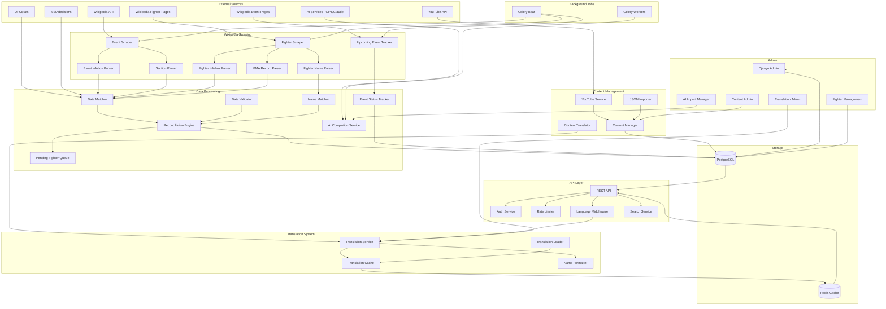
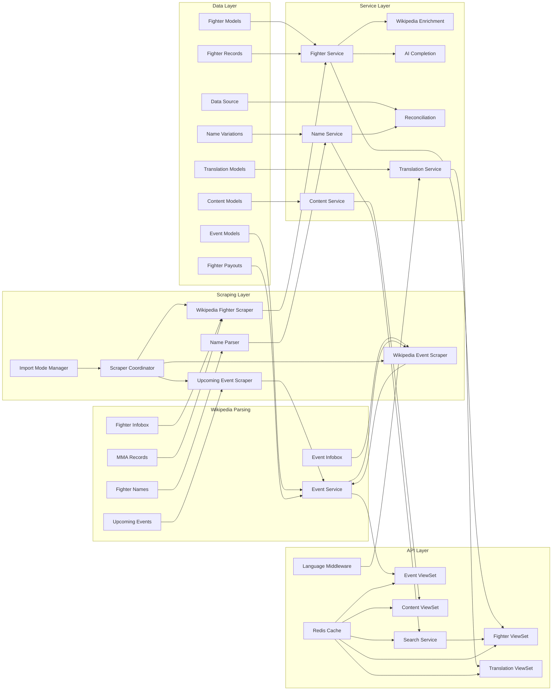
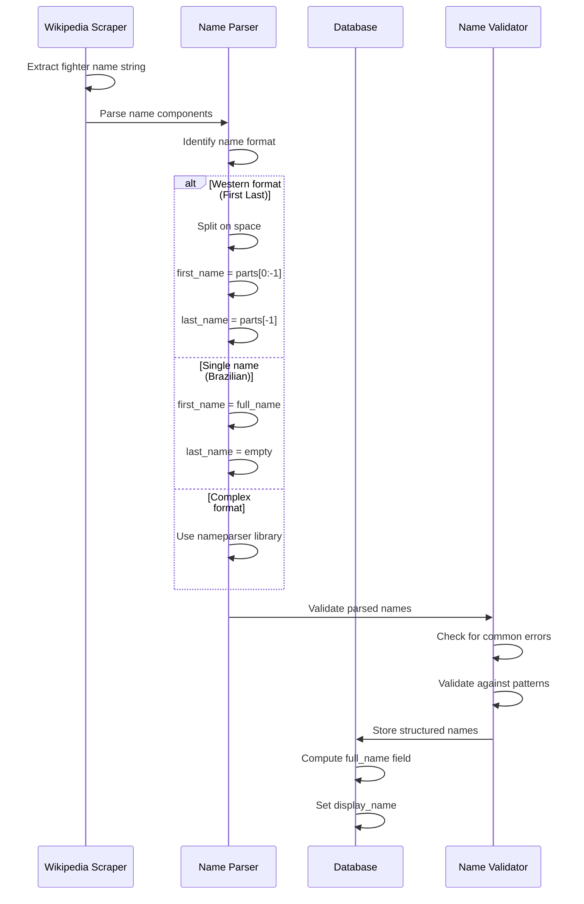
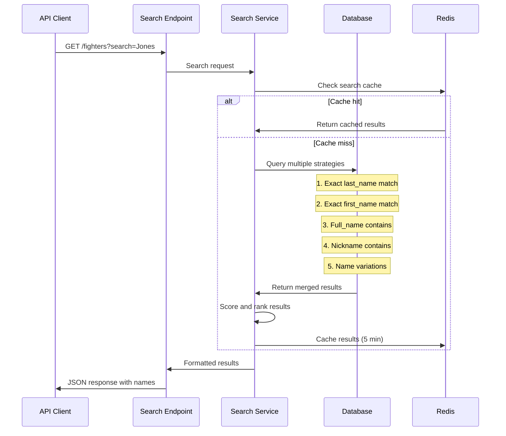
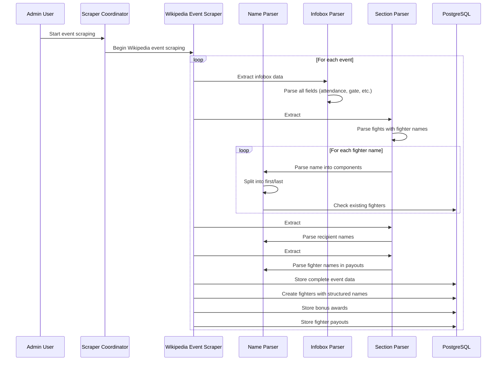
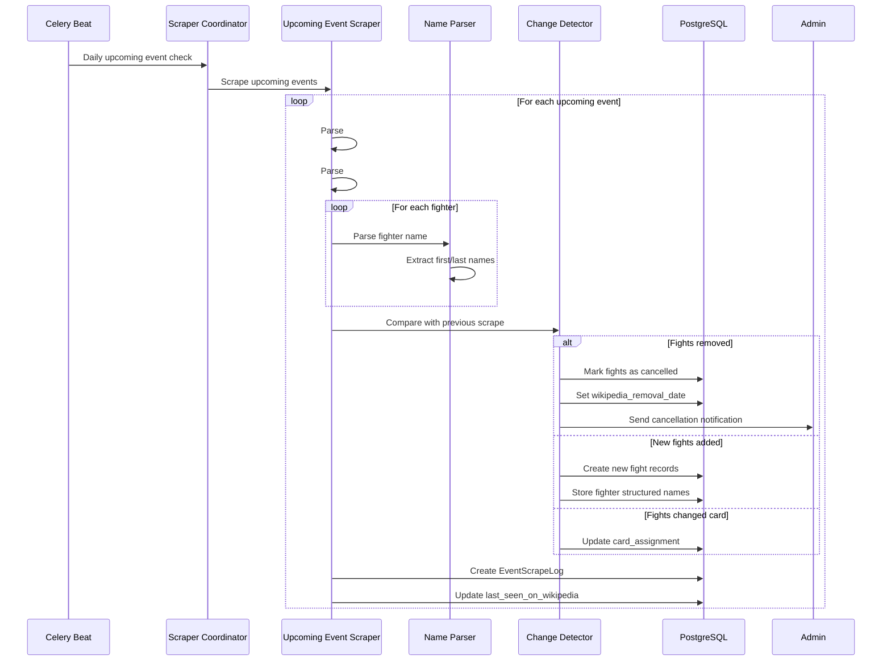
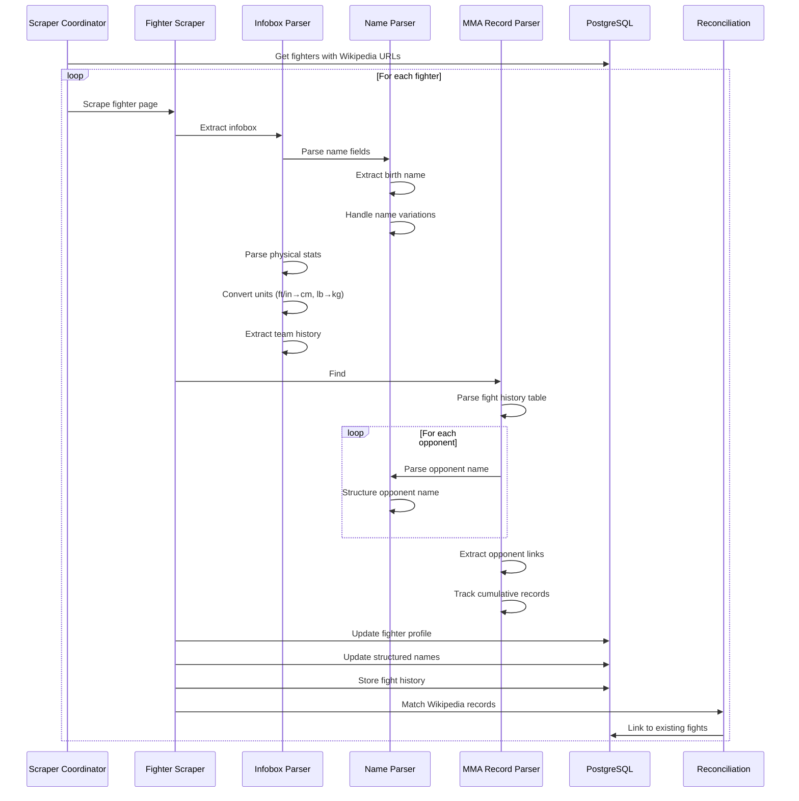
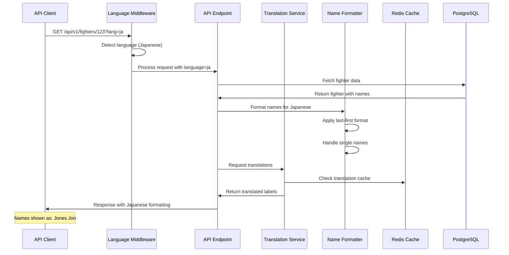
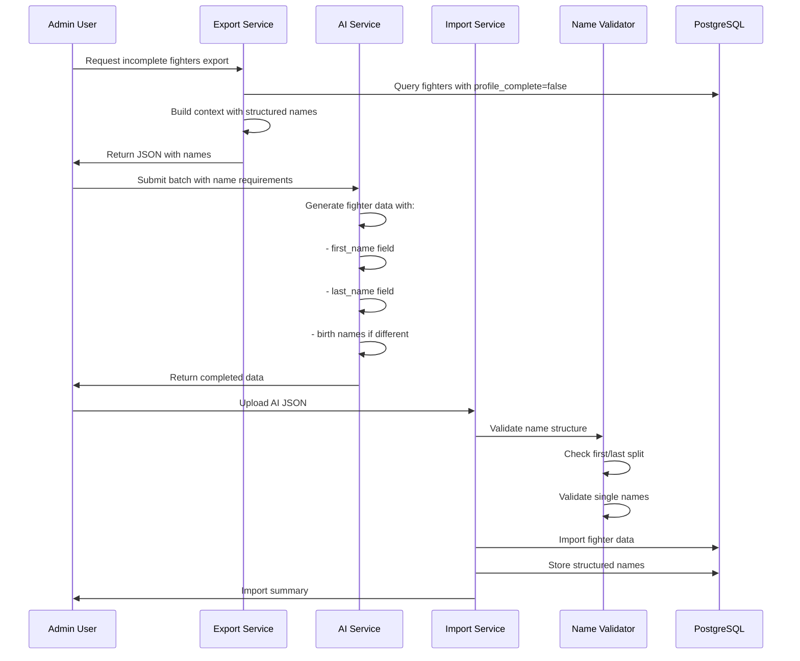
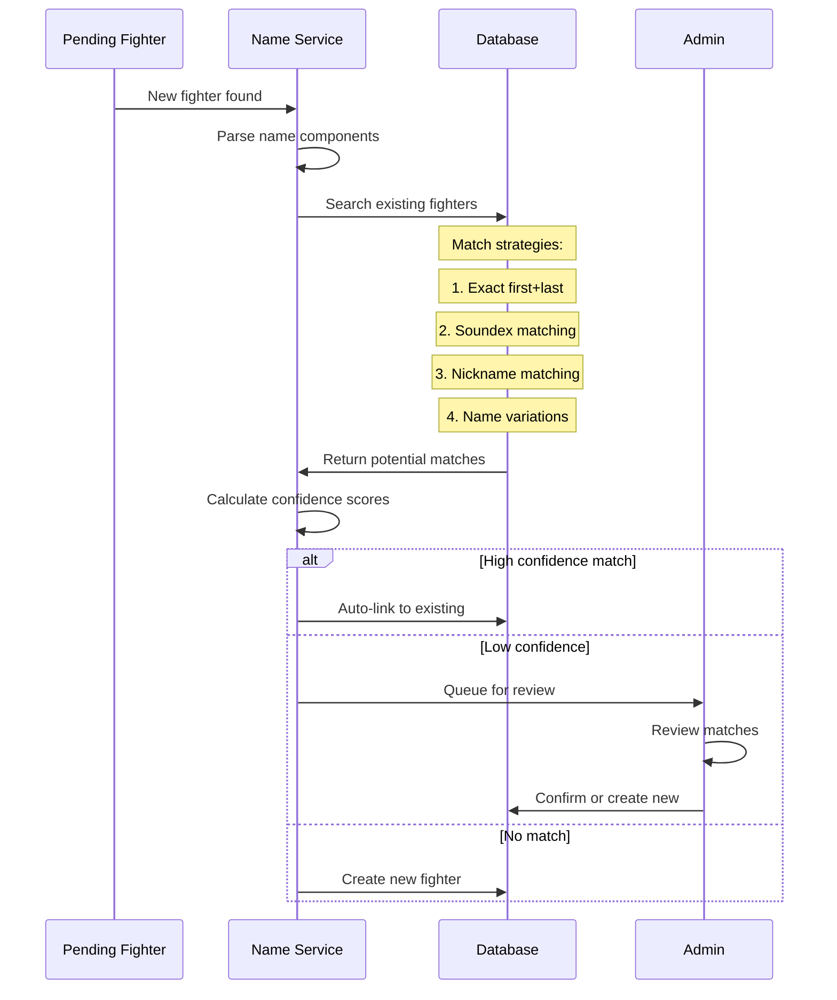

# MMA Database Backend Architecture Document v1.5

## Introduction

This document outlines the overall project architecture for the MMA Database Backend, including backend systems, shared services, content management, translation infrastructure, and non-UI specific concerns. Its primary goal is to serve as the guiding architectural blueprint for AI-driven development, ensuring consistency and adherence to chosen patterns and technologies.

**Relationship to Frontend Architecture:**
Since this is a backend-only API project with Django Admin as the only UI, no separate frontend architecture document is needed. The Django Admin interface is handled through Django's built-in capabilities.

### Starter Template or Existing Project

N/A - Greenfield project built from scratch with Django

### Change Log

| Date | Version | Description | Author |
|------|---------|-------------|---------|
| 2024-12-12 | 1.0 | Initial architecture creation | Winston (Architect) |
| 2024-12-13 | 1.1 | Added content system, pending fighters, storylines | Winston (Architect) |
| 2024-12-13 | 1.2 | Simplified to Wikipedia-first approach with AI completion | Winston (Architect) |
| 2024-12-13 | 1.3 | Added comprehensive Wikipedia scraping details | Winston (Architect) |
| 2024-12-13 | 1.4 | Added upcoming events tracking and translation system | Winston (Architect) |
| 2024-12-13 | 1.5 | Added structured fighter names (first/last) | Winston (Architect) |

## High Level Architecture

### Technical Summary

The system employs a modular monolith architecture using Django, with separate apps for each major domain (fighters, events, scrapers, content, translations). The architecture emphasizes data integrity through a comprehensive Wikipedia-first approach with AI-powered completion for missing data. PostgreSQL serves as the primary datastore with Redis for caching and Celery for asynchronous task processing. The system extracts complete data from Wikipedia including event infoboxes, fighter profiles with structured names, full career histories, and tracks upcoming events in real-time. Multi-language support is built into the core architecture, enabling global accessibility with culturally appropriate name formatting.

### High Level Overview

**Architectural Style**: Modular Monolith transitioning to potential microservices
**Repository Structure**: Monorepo containing all services and scrapers
**Service Architecture**: Django apps with clear bounded contexts
**Primary Data Flow**: 
1. Initial bulk import populates historical data from Wikipedia events
2. Complete event infobox data extracted including attendance, gate, buyrate
3. Fighter profiles created with structured names (first/last) and Wikipedia links
4. Fighter Wikipedia pages scraped for complete infobox and career history
5. Fighter names parsed into structured components for better search
6. AI-powered completion for fighters without Wikipedia pages
7. Ongoing mode tracks upcoming events and detects cancellations
8. Translation system provides multi-language support with name formatting
9. Content management system handles editorial content
10. API serves data and content with Redis caching layer
11. Admin panel provides manual data and content management

**Key Architectural Decisions**:
- Monolith-first approach for MVP simplicity
- PostgreSQL for complex relational data and full-text search
- Redis for caching and Celery message broker
- Wikipedia-first data strategy for consistency
- Structured fighter names (first/last) for data quality
- Comprehensive infobox extraction for complete data
- Full fighter career history from Wikipedia records
- Real-time upcoming event tracking
- AI completion for data gaps
- Two-phase import system (initial bulk, then ongoing with review)
- Unified content model for flexibility
- YouTube integration for video content
- Hierarchical translation system with fallbacks

### High Level Project Diagram



### Architectural and Design Patterns

- **Repository Pattern**: Abstract data access logic for testability and flexibility - *Rationale:* Enables easy testing with mocks and potential future database migrations
- **Service Layer Pattern**: Business logic separated from Django views/serializers - *Rationale:* Promotes reusability and keeps views thin
- **Strategy Pattern**: Different data enrichment strategies (Wikipedia vs AI) and name parsing strategies - *Rationale:* Allows flexible data completion and name handling
- **Template Method Pattern**: Wikipedia section parsing with customizable extractors - *Rationale:* Handles variations in Wikipedia page structures
- **Observer Pattern**: Event-driven cache invalidation and fight status updates - *Rationale:* Ensures cache consistency and real-time tracking
- **Circuit Breaker Pattern**: External API failure handling - *Rationale:* Prevents cascade failures when sources are down
- **Factory Pattern**: Content creation based on type and fighter creation with name parsing - *Rationale:* Handles different content types and name formats uniformly
- **State Machine Pattern**: Fight status transitions (scheduled → cancelled) - *Rationale:* Tracks fight lifecycle changes
- **Adapter Pattern**: Wikipedia infobox to model field mapping including name parsing - *Rationale:* Handles varying infobox formats
- **Chain of Responsibility**: Translation fallback mechanism and name search strategies - *Rationale:* Provides graceful language degradation and flexible search
- **Decorator Pattern**: Language-aware caching with name-based keys - *Rationale:* Adds language and name dimensions to cache keys

## Tech Stack

### Cloud Infrastructure

- **Provider:** Render.com
- **Key Services:** Web Service, Background Workers, PostgreSQL, Redis
- **Deployment Regions:** US-East (primary)

### Technology Stack Tablesd

| Category | Technology | Version | Purpose | Rationale |
|----------|------------|---------|---------|-----------|
| **Language** | Python | 3.12 | Primary development language | Latest stable, excellent library ecosystem |
| **Framework** | Django | 5.0.1 | Web framework | Mature, includes admin panel, excellent ORM |
| **API Framework** | Django REST Framework | 3.14.0 | REST API | De facto standard for Django APIs |
| **Database** | PostgreSQL | 15.5 | Primary datastore | JSONB support, full-text search, robust |
| **Cache** | Redis | 7.2 | Caching & message broker | Fast, versatile, Celery support |
| **Task Queue** | Celery | 5.3.4 | Async task processing | Mature, Django integration |
| **Web Server** | Gunicorn | 21.2.0 | WSGI HTTP Server | Production-ready, simple configuration |
| **HTTP Client** | httpx | 0.25.2 | Async HTTP requests | Modern, async support for scrapers |
| **HTML Parser** | BeautifulSoup4 | 4.12.2 | HTML parsing | Simple, robust HTML parsing |
| **Wikipedia** | Wikipedia-API | 0.6.0 | Wikipedia integration | Official Python Wikipedia API |
| **Testing** | pytest | 7.4.3 | Test framework | Better fixtures, parameterization |
| **API Docs** | drf-spectacular | 0.27.0 | OpenAPI/Swagger | Auto-generated API documentation |
| **Monitoring** | Sentry | 1.39.1 | Error tracking | Real-time error monitoring |
| **Scheduling** | Celery Beat | 5.3.4 | Task scheduling | Integrated with Celery |
| **Static Files** | WhiteNoise | 6.6.0 | Static file serving | Simple, efficient for Render |
| **CORS** | django-cors-headers | 4.3.1 | CORS handling | Configurable CORS for API |
| **Environment** | python-decouple | 3.8 | Config management | 12-factor app compliance |
| **Linting** | Black/isort/flake8 | Latest | Code formatting | Consistent code style |
| **Rich Text** | Django-CKEditor | 6.7.0 | Content editing | Rich text for storylines/blogs |
| **YouTube** | pytube | 15.0.0 | YouTube metadata | Extract video information |
| **AI Integration** | OpenAI/Anthropic SDK | Latest | AI completion | Fighter data generation |
| **Translation** | Django-Modeltranslation | 0.18.11 | Model translations | Database-level translations |
| **Localization** | Babel | 2.13.1 | Date/time formatting | Locale-aware formatting |
| **Name Parsing** | python-nameparser | 1.1.3 | Name parsing | Parse fighter names into components |

## Data Models

### Fighter Model

**Purpose:** Represents individual MMA fighters with complete profile information and structured names from Wikipedia

**Key Attributes:**
- id: UUID - Primary key
- first_name: String - Fighter's first name (required)
- last_name: String - Fighter's last name (can be empty for single-name fighters)
- full_name: String - Computed/cached full name
- display_name: String - How fighter prefers to be displayed
- birth_first_name: String (nullable) - Legal first name at birth
- birth_last_name: String (nullable) - Legal last name at birth
- nickname: String (nullable) - Fighter nickname
- other_names: JSONB - List of alternative names/aliases
- date_of_birth: Date (nullable) - Fighter's birthdate
- birth_place: String (nullable) - City, Country of birth
- nationality: String (nullable) - Fighter's country
- height_cm: Integer (nullable) - Height in centimeters
- weight_kg: Float (nullable) - Weight in kilograms
- reach_cm: Integer (nullable) - Reach in centimeters
- stance: String (nullable) - Orthodox/Southpaw/Switch
- gym: String (nullable) - Current training gym/team
- team_history: JSONB - List of teams with date ranges
- fighting_out_of: String (nullable) - Location fighter represents
- years_active: String (nullable) - e.g., "2010-present"
- active: Boolean - Active/Retired status
- image_url: String (nullable) - Fighter photo URL
- wikipedia_url: String (nullable) - Wikipedia page URL
- data_source: String - wikipedia_event/wikipedia_profile/ai_generated
- profile_complete: Boolean - Whether all data is populated
- last_enrichment_attempt: DateTime (nullable) - Last scraping attempt
- ai_generation_date: DateTime (nullable) - When AI data was generated
- ai_batch_id: UUID (nullable) - Link to AI generation batch
- mma_record_wins: Integer - Total wins
- mma_record_losses: Integer - Total losses
- mma_record_draws: Integer - Total draws
- mma_record_no_contests: Integer - Total no contests
- wins_by_knockout: Integer - KO/TKO wins
- wins_by_submission: Integer - Submission wins
- wins_by_decision: Integer - Decision wins
- losses_by_knockout: Integer - KO/TKO losses
- losses_by_submission: Integer - Submission losses
- losses_by_decision: Integer - Decision losses

**Relationships:**
- Has many Fights (through FightParticipant)
- Has many FighterRecords (Wikipedia career history)
- Has many Rankings
- Has many NameVariations
- Has many ContentFighters
- Has many Payouts
- Has many FighterTranslations

**Methods:**
- save(): Auto-computes full_name from first_name + last_name
- get_display_name(): Returns display_name or full_name
- get_formatted_name(style): Returns name in specified format

### NameVariation Model

**Purpose:** Track alternative names and spellings for fighters with structured fields

**Key Attributes:**
- id: UUID - Primary key
- fighter_id: UUID - Foreign key to Fighter
- first_name_variation: String (nullable) - Alternative first name
- last_name_variation: String (nullable) - Alternative last name
- full_name_variation: String - Complete alternative name
- variation_type: String - 'spelling', 'cultural', 'legal', 'nickname'
- source: String - Where this variation was found

**Relationships:**
- Belongs to Fighter

### Event Model

**Purpose:** Represents MMA events with complete Wikipedia infobox data

**Key Attributes:**
- id: UUID - Primary key
- name: String - Event name
- organization: String - UFC/KSW/Oktagon/PFL
- date: Date - Event date
- location: String - City, Country
- venue: String (nullable) - Venue name
- attendance: Integer (nullable) - Attendance figures
- gate_revenue: Decimal (nullable) - Gate revenue in USD
- buyrate: Integer (nullable) - PPV buy numbers
- broadcast_viewership: Integer (nullable) - TV/streaming viewers
- purse: Decimal (nullable) - Total fighter purse
- promotion_logo: URL (nullable) - Event/promotion logo
- wikipedia_url: String - Source Wikipedia page
- previous_event_id: UUID (nullable) - Link to previous event
- following_event_id: UUID (nullable) - Link to following event
- has_payout_info: Boolean - Whether payout data exists
- bonus_award_amount: Decimal (nullable) - Bonus amount (usually $50,000)

**Relationships:**
- Has many Fights
- Has many FighterPayouts
- Has many EventScrapeLogs
- Belongs to previous/following Event

### Fight Model

**Purpose:** Represents individual fights with complete result information and status tracking

**Key Attributes:**
- id: UUID - Primary key
- event_id: UUID - Foreign key to Event
- fight_order: Integer - Order on card (main=1)
- weight_class: String - Division
- scheduled_rounds: Integer - 3 or 5 rounds
- is_title_fight: Boolean - Championship fight
- is_main_event: Boolean - Main event flag
- is_comain_event: Boolean - Co-main event flag
- status: String - scheduled/confirmed/announced/completed/cancelled/postponed/no_contest
- card_assignment: String - main/prelim/early_prelim/announced/unassigned
- last_seen_on_wikipedia: DateTime - Last time found on Wikipedia
- wikipedia_removal_date: DateTime (nullable) - When removed from Wikipedia
- cancellation_reason: Text (nullable) - Why fight was cancelled
- method: String - KO/TKO/Sub/Dec/etc
- method_details: String (nullable) - Specific submission/etc
- round: Integer (nullable) - Ending round
- time: String (nullable) - Time of finish
- referee: String (nullable) - Referee name
- bonus_awards: JSONB - {"fight_of_night": true, "performance_of_night": ["fighter_id"]}

**Relationships:**
- Belongs to Event
- Has many FightParticipants (exactly 2)
- Has one FightStatistics
- Has many Scorecards
- Has one FightStoryline (optional)

### EventScrapeLog Model

**Purpose:** Track changes in fights between Wikipedia scrapes

**Key Attributes:**
- id: UUID - Primary key
- event_id: UUID - Foreign key to Event
- scrape_date: DateTime - When scrape occurred
- fights_found: JSONB - List of fight details found
- fights_added: Integer - New fights added
- fights_removed: Integer - Fights removed (cancelled)
- fights_updated: Integer - Fights with changes
- raw_data: JSONB - Raw Wikipedia data for reference

**Relationships:**
- Belongs to Event

### Language Model

**Purpose:** Define supported languages for the platform

**Key Attributes:**
- id: UUID - Primary key
- code: String - ISO 639-1 code (e.g., 'en', 'es', 'pt-BR')
- name: String - Language name in English
- native_name: String - Language name in native script
- is_active: Boolean - Whether language is enabled
- is_default: Boolean - Default language flag (only one)
- rtl: Boolean - Right-to-left language flag
- name_format: String - Preferred name format ('first_last', 'last_first')

**Relationships:**
- Has many Translations
- Has many ContentTranslations
- Has many FighterTranslations

### TranslationKey Model

**Purpose:** Static translation keys for UI elements including name display formats

**Key Attributes:**
- id: UUID - Primary key
- key: String - Hierarchical key (e.g., 'fighter.record.wins', 'name.format.display')
- category: String - Grouping category (e.g., 'ui', 'fighter', 'event')
- description: Text - Help text for translators
- is_plural: Boolean - Whether plural forms needed

**Relationships:**
- Has many Translations

### Translation Model

**Purpose:** Actual translations for static keys

**Key Attributes:**
- id: UUID - Primary key
- translation_key_id: UUID - Foreign key to TranslationKey
- language_id: UUID - Foreign key to Language
- value: Text - Translated text
- plural_value: Text (nullable) - Plural form if needed
- is_verified: Boolean - Quality check flag
- verified_by: String (nullable) - Reviewer name

**Relationships:**
- Belongs to TranslationKey
- Belongs to Language

### ContentTranslation Model

**Purpose:** Translations for dynamic content

**Key Attributes:**
- id: UUID - Primary key
- content_id: UUID - Foreign key to Content
- language_id: UUID - Foreign key to Language
- title: String - Translated title
- description: Text - Translated description
- content_text: Text (nullable) - Full translated content
- meta_description: String - SEO description
- is_machine_translated: Boolean - Auto-translation flag
- is_verified: Boolean - Human review flag
- translated_by: String (nullable) - Translator name

**Relationships:**
- Belongs to Content
- Belongs to Language

### FightStorylineTranslation Model

**Purpose:** Translations for fight storylines

**Key Attributes:**
- id: UUID - Primary key
- storyline_id: UUID - Foreign key to FightStoryline
- language_id: UUID - Foreign key to Language
- title: String - Translated title
- summary: Text - Translated summary
- buildup: Text - Translated buildup narrative
- beef_history: Text (nullable) - Translated rivalry history
- stakes: Text - Translated stakes description
- is_verified: Boolean - Quality check flag
- translated_by: String (nullable) - Translator name

**Relationships:**
- Belongs to FightStoryline
- Belongs to Language

### FighterTranslation Model

**Purpose:** Fighter-specific translations including name display preferences

**Key Attributes:**
- id: UUID - Primary key
- fighter_id: UUID - Foreign key to Fighter
- language_id: UUID - Foreign key to Language
- display_name: String (nullable) - Localized display name
- nickname: String (nullable) - Translated nickname
- bio: Text (nullable) - Fighter biography in language

**Relationships:**
- Belongs to Fighter
- Belongs to Language

### FighterRecord Model

**Purpose:** Complete fight history from Wikipedia MMA record section

**Key Attributes:**
- id: UUID - Primary key
- fighter_id: UUID - Foreign key to Fighter
- record_number: Integer - Fight number in career (reverse chronological)
- result: String - Win/Loss/Draw/NC
- record_at_time: String - Cumulative record (e.g., "23-1-0")
- opponent_full_name: String - Opponent's full name
- opponent_wikipedia_url: URL (nullable) - Opponent's Wikipedia page
- method: String - How fight ended
- event_name: String - Event where fight occurred
- event_wikipedia_url: URL (nullable) - Event Wikipedia page
- date: Date - Fight date
- round: Integer (nullable) - Round ended
- time: String (nullable) - Time of stoppage
- location: String - Venue location
- notes: Text - Additional notes (title defense, etc.)

**Relationships:**
- Belongs to Fighter
- May link to opponent Fighter
- May link to Event

### FighterPayout Model

**Purpose:** Fighter compensation data from Wikipedia event pages

**Key Attributes:**
- id: UUID - Primary key
- event_id: UUID - Foreign key to Event
- fighter_id: UUID - Foreign key to Fighter
- show_money: Decimal (nullable) - Base pay
- win_bonus: Decimal (nullable) - Win bonus
- performance_bonus: Decimal (nullable) - POTN bonus
- fight_of_night_bonus: Decimal (nullable) - FOTN bonus
- total_payout: Decimal (nullable) - Total compensation
- currency: String - Currency code (usually USD)
- source_notes: Text - Wikipedia citation info

**Relationships:**
- Belongs to Event
- Belongs to Fighter

### PendingFighter Model

**Purpose:** Temporary storage for unverified fighters from new event scraping with structured names

**Key Attributes:**
- id: UUID - Primary key
- first_name: String - Fighter's first name from parsing
- last_name: String - Fighter's last name from parsing
- full_name: String - Complete name as found
- event_id: UUID - Source event where first seen
- wikipedia_url: String (nullable) - Wikipedia URL if found
- suggested_match_id: UUID (nullable) - Potential existing fighter match
- match_confidence: Float - Confidence score of suggested match
- status: String - pending/approved/rejected
- admin_notes: Text - Review notes
- created_at: DateTime - When discovered
- reviewed_at: DateTime (nullable) - When admin reviewed
- reviewed_by: String (nullable) - Admin who reviewed

**Relationships:**
- Belongs to Event (source event)
- May reference Fighter (suggested match)

### Content Model

**Purpose:** Unified model for all content types: news articles, blog posts, and videos

**Key Attributes:**
- id: UUID - Primary key
- content_type: String - 'news', 'blog', 'video'
- title: String - Content title
- slug: String - URL-friendly version
- description: Text - Brief summary/excerpt
- content: Text (nullable) - Full text (for news/blog)
- video_url: String (nullable) - YouTube/video URL
- video_id: String (nullable) - YouTube video ID for embedding
- video_duration: Integer (nullable) - Video length in seconds
- thumbnail_url: String - Custom or YouTube thumbnail
- author: String - Content creator
- source: String (nullable) - Original source
- published_date: DateTime - Publication date
- is_featured: Boolean - Homepage highlighting
- tags: JSONB - Categorization tags
- view_count: Integer - Popularity tracking
- status: String - draft/published/archived
- meta_description: String - SEO description
- content_format: String - 'text', 'video', 'mixed'
- reading_time: Integer (nullable) - Estimated minutes

**Relationships:**
- Has many ContentFighters (many-to-many with Fighter)
- Has many ContentEvents (many-to-many with Event)
- Has many ContentTranslations

### FightStoryline Model

**Purpose:** Editorial content describing the build-up, rivalry, and stakes for main/co-main events

**Key Attributes:**
- id: UUID - Primary key
- fight_id: UUID - Foreign key to Fight (unique)
- title: String - Compelling headline
- summary: Text - Brief 2-3 sentence summary
- buildup: Text - Detailed narrative of the fight build-up
- beef_history: Text (nullable) - History of rivalry/conflicts
- stakes: Text - What's on the line for each fighter
- key_moments: JSONB - Array of notable pre-fight moments
- media_links: JSONB (nullable) - Links to press conferences
- author: String (nullable) - Content creator attribution
- published: Boolean - Draft/published status

**Relationships:**
- Belongs to Fight (one-to-one)
- Has many FightStorylineTranslations
- Only for main/co-main events

### AIGenerationBatch Model

**Purpose:** Track AI data generation batches for audit and quality control

**Key Attributes:**
- id: UUID - Primary key
- generation_date: DateTime - When batch was generated
- fighter_count: Integer - Number of fighters in batch
- model_used: String - GPT-4/Claude/etc
- prompt_template: Text - Template used for generation
- status: String - pending/completed/failed
- import_date: DateTime (nullable) - When imported
- imported_by: String (nullable) - Admin who imported

**Relationships:**
- Has many Fighters (through ai_batch_id)

### Supporting Models

**FightParticipant**: Join table for Fight-Fighter relationship
**FightStatistics**: Detailed statistics for a fight
**Scorecard**: Judge scores for decisions
**DataSource**: Track data origin for reconciliation
**ContentFighter**: Links content to fighters
**ScraperConfiguration**: Track scraper state and mode

## Components

### Core Django Apps

**fighters**
**Responsibility:** Fighter management, profiles, name reconciliation, and translations

**Key Interfaces:**
- FighterService: CRUD operations and profile management with name handling
- WikipediaEnrichmentService: Enrich fighters from Wikipedia pages
- NameParser: Parse fighter names into structured components
- InboxParser: Extract and convert fighter stats from Wikipedia
- RecordParser: Parse complete fight history from Wikipedia
- AICompletionService: Generate missing fighter data
- PendingFighterService: Review and approval workflow with name editing
- FighterTranslationService: Manage fighter-specific translations
- NameSearchService: Advanced name-based search functionality
- NameVariationService: Handle alternative names and spellings

**Dependencies:** translations app

**Technology Stack:** Django models, Wikipedia API, AI SDKs, python-nameparser

---

**events**
**Responsibility:** Event and fight management with comprehensive Wikipedia data and status tracking

**Key Interfaces:**
- EventService: Event CRUD and fight card management
- EventInfoboxParser: Extract all Wikipedia event infobox fields
- SectionExtractor: Parse Results, Bonus awards, Payout sections
- UpcomingEventTracker: Monitor fight changes and cancellations
- FightService: Fight records and result management
- FightStatusService: Handle status transitions
- PayoutService: Fighter compensation management
- StorylineService: Editorial content for main events
- EventChangeDetector: Compare scrapes and detect changes

**Dependencies:** fighters app for fighter relationships

**Technology Stack:** Django models, Wikipedia parsing

---

**scrapers**
**Responsibility:** Comprehensive Wikipedia data extraction with real-time tracking and name parsing

**Key Interfaces:**
- ScraperCoordinator: Orchestrates scraping workflow
- WikipediaEventScraper: Complete event data extraction
  - InfoboxExtractor: Parse event infobox template
  - ResultsParser: Extract fight results with fighter links
  - FighterNameExtractor: Parse fighter names from results
  - BonusParser: Extract bonus awards and amounts
  - PayoutParser: Extract fighter salaries
- WikipediaUpcomingEventScraper: Track upcoming events
  - FightCardParser: Parse #Fight_card section
  - AnnouncedFightsParser: Parse #Announced_fights
  - ChangeDetector: Compare with previous scrapes
- WikipediaFighterScraper: Fighter profile enrichment
  - FighterInfoboxParser: Extract all stats with conversions
  - FighterNameParser: Extract structured name components
  - MMARecordParser: Complete fight history extraction
- UFCStatsScraper: Statistics extraction with name matching
- MMAdecisionsScraper: Scorecard extraction with name matching
- ImportModeManager: Handles initial vs ongoing modes

**Dependencies:** fighters, events, reconciliation

**Technology Stack:** httpx, BeautifulSoup4, Wikipedia-API, Celery, python-nameparser

---

**ai_completion**
**Responsibility:** AI-powered data completion for fighters with name validation

**Key Interfaces:**
- AICompletionService: Generate fighter data with structured names
- PromptBuilder: Create context-aware prompts with name requirements
- BatchExporter: Export incomplete fighters with name structure
- BatchImporter: Import and validate AI data with name parsing
- ValidationService: Ensure realistic generated data and valid names

**Dependencies:** fighters

**Technology Stack:** OpenAI/Anthropic SDKs, JSON validation

---

**reconciliation**
**Responsibility:** Match Wikipedia records to database fights with name-aware matching

**Key Interfaces:**
- ReconciliationEngine: Main matching logic with name handling
- RecordMatcher: Match Wikipedia fights to our fights
- EventMatcher: Link fights to events
- OpponentMatcher: Handle name variations and single names
- NameSimilarityScorer: Calculate name match confidence
- ConfidenceScorer: Calculate overall match confidence

**Dependencies:** fighters, events

**Technology Stack:** PostgreSQL fuzzy matching, Levenshtein, python-nameparser

---

**content**
**Responsibility:** Unified content management for news, blogs, videos with translations

**Key Interfaces:**
- ContentService: CRUD for all content types
- YouTubeService: Video metadata extraction
- FighterAssociationService: Link content to fighters by ID
- PublishingService: Draft/publish workflow
- ContentTranslationService: Manage content translations
- RelatedContentService: Language-aware recommendations

**Dependencies:** fighters, events, translations

**Technology Stack:** Django models, YouTube API, Rich text editor

---

**translations**
**Responsibility:** Comprehensive translation management for static and dynamic content with name formatting

**Key Interfaces:**
- TranslationService: Core translation retrieval with caching
- LanguageService: Manage supported languages with name formats
- TranslationKeyService: Static key management
- TranslationLoader: Bulk translation loading
- TranslationExporter: Export/import translations
- CoverageAnalyzer: Translation completeness analysis
- FallbackHandler: Language fallback logic
- RTLHandler: Right-to-left language support
- NameFormatterService: Culture-specific name formatting

**Dependencies:** None (base app)

**Technology Stack:** Django models, Redis caching, Babel

---

**api**
**Responsibility:** REST API endpoints with authentication, language support, and name search

**Key Interfaces:**
- FighterViewSet: Fighter endpoints with name search
- EventViewSet: Event endpoints with complete data
- FightViewSet: Fight endpoints with status tracking
- RankingViewSet: Ranking endpoints
- ContentViewSet: Content endpoints with translations
- PayoutViewSet: Fighter compensation endpoints
- TranslationViewSet: Language and coverage endpoints
- LanguageMiddleware: Request language detection
- NameSearchView: Advanced fighter name search endpoint

**Dependencies:** All core apps

**Technology Stack:** Django REST Framework, Redis caching

### Component Interaction Diagram



## External APIs

### Wikipedia API
- **Purpose:** Primary source for all event and fighter data
- **Documentation:** https://www.mediawiki.org/wiki/API:Main_page
- **Base URL(s):** https://en.wikipedia.org/w/api.php
- **Authentication:** None required
- **Rate Limits:** 200 requests/second (we limit to 2/second)

**Key Endpoints Used:**
- `GET /api.php?action=query&prop=revisions` - Fetch page content
- `GET /api.php?action=parse` - Parse page sections
- `GET /api.php?action=query&prop=templates` - Extract infobox data

**Integration Notes:** 
- Use page templates for consistent parsing
- Extract fighter names and parse into components
- Extract fighter URLs during event parsing
- Handle redirects and disambiguation pages
- Parse specific sections by anchor (#Results, #Bonus_awards, etc.)
- Monitor upcoming events for changes

---

### UFCStats (Web Scraping)
- **Purpose:** Detailed fight statistics for UFC fights
- **Documentation:** No official API - web scraping required
- **Base URL(s):** http://www.ufcstats.com
- **Authentication:** None
- **Rate Limits:** Self-imposed 1 request/3 seconds

**Key Endpoints Used:**
- `/fight-details/{fight-id}` - Fight statistics pages

**Integration Notes:** 
- Only available for UFC fights
- Match fighters using structured names

---

### MMAdecisions (Web Scraping)
- **Purpose:** Judge scorecards for decision fights
- **Documentation:** No official API - web scraping required
- **Base URL(s):** http://www.mmadecisions.com
- **Authentication:** None
- **Rate Limits:** Self-imposed 1 request/3 seconds

**Key Endpoints Used:**
- `/decision/{fight-details}` - Scorecard pages

**Integration Notes:** 
- Match by fighter names and event date
- Use fuzzy name matching for variations

---

### YouTube API (Optional)
- **Purpose:** Extract video metadata and generate thumbnails
- **Documentation:** https://developers.google.com/youtube/v3
- **Base URL(s):** https://www.googleapis.com/youtube/v3
- **Authentication:** API Key required
- **Rate Limits:** 10,000 units per day

**Key Endpoints Used:**
- `GET /videos?id={video_id}` - Get video details

**Integration Notes:** Fallback to URL parsing if quota exceeded

---

### AI Services (OpenAI/Anthropic)
- **Purpose:** Generate missing fighter data with structured names
- **Documentation:** Platform-specific API docs
- **Authentication:** API Key required
- **Rate Limits:** Based on tier/plan

**Integration Notes:**
- Use structured output format
- Include name structure requirements in prompts
- Validate generated names
- Include fight context for accuracy

## Core Workflows

### Fighter Name Parsing Workflow



### Fighter Search Workflow



### Comprehensive Wikipedia Event Scraping with Names



### Upcoming Event Tracking Workflow



### Fighter Wikipedia Enrichment Workflow



### Multi-Language API Request with Name Formatting



### AI Data Completion with Name Validation



### Name Deduplication Workflow



## REST API Spec

```yaml
openapi: 3.0.0
info:
  title: MMA Database API
  version: 1.0.0
  description: Comprehensive MMA data and content API with multi-language support and structured fighter names
servers:
  - url: https://api.mmadatabase.com/api/v1
    description: Production server

components:
  securitySchemes:
    ApiKeyAuth:
      type: apiKey
      in: header
      name: X-API-Key
      
  parameters:
    languageParam:
      name: lang
      in: query
      description: Response language (ISO 639-1 code)
      schema:
        type: string
        default: en
        enum: [en, es, pt, fr, de, it, ja, ko, zh, ar, he]

  schemas:
    Fighter:
      type: object
      properties:
        id:
          type: string
          format: uuid
        first_name:
          type: string
          description: Fighter's first name
        last_name:
          type: string
          description: Fighter's last name (empty for single-name fighters)
        full_name:
          type: string
          description: Computed full name
        display_name:
          type: string
          description: Preferred display name
        nickname:
          type: string
          description: Fighter nickname (translated if available)
        birth_first_name:
          type: string
        birth_last_name:
          type: string
        other_names:
          type: array
          items:
            type: object
            properties:
              first_name:
                type: string
              last_name:
                type: string
              type:
                type: string
                enum: [spelling, cultural, legal]
        date_of_birth:
          type: string
          format: date
        nationality:
          type: string
        height_cm:
          type: integer
        weight_kg:
          type: number
        reach_cm:
          type: integer
        stance:
          type: string
          enum: [orthodox, southpaw, switch]
        team:
          type: string
        team_history:
          type: array
          items:
            type: object
            properties:
              team:
                type: string
              start_date:
                type: string
              end_date:
                type: string
        fighting_out_of:
          type: string
        years_active:
          type: string
        wikipedia_url:
          type: string
          format: uri
        data_source:
          type: string
          enum: [wikipedia_event, wikipedia_profile, ai_generated, manual_entry]
        profile_complete:
          type: boolean
        record:
          type: object
          properties:
            wins:
              type: integer
            losses:
              type: integer
            draws:
              type: integer
            no_contests:
              type: integer
        win_breakdown:
          type: object
          properties:
            knockout:
              type: integer
            submission:
              type: integer
            decision:
              type: integer
        recent_content:
          type: array
          items:
            $ref: '#/components/schemas/ContentSummary'
    
    FighterSummary:
      type: object
      properties:
        id:
          type: string
          format: uuid
        first_name:
          type: string
        last_name:
          type: string
        full_name:
          type: string
        display_name:
          type: string
        nickname:
          type: string
          
    Event:
      type: object
      properties:
        id:
          type: string
          format: uuid
        name:
          type: string
        organization:
          type: string
          enum: [UFC, KSW, Oktagon, PFL]
        date:
          type: string
          format: date
        location:
          type: string
        venue:
          type: string
        attendance:
          type: integer
        gate_revenue:
          type: number
        buyrate:
          type: integer
        broadcast_viewership:
          type: integer
        total_purse:
          type: number
        bonus_award_amount:
          type: number
        has_payout_info:
          type: boolean
        wikipedia_url:
          type: string
        previous_event:
          $ref: '#/components/schemas/EventSummary'
        following_event:
          $ref: '#/components/schemas/EventSummary'
        
    Fight:
      type: object
      properties:
        id:
          type: string
          format: uuid
        event:
          $ref: '#/components/schemas/EventSummary'
        fighters:
          type: array
          items:
            $ref: '#/components/schemas/FighterSummary'
        weight_class:
          type: string
        status:
          type: string
          enum: [scheduled, confirmed, announced, completed, cancelled, postponed, no_contest]
        status_label:
          type: string
          description: Translated status label
        card_assignment:
          type: string
          enum: [main, prelim, early_prelim, announced, unassigned]
        card_label:
          type: string
          description: Translated card position
        method:
          type: string
        round:
          type: integer
        time:
          type: string
        storyline:
          $ref: '#/components/schemas/FightStoryline'
        
    FighterRecord:
      type: object
      properties:
        record_number:
          type: integer
        result:
          type: string
          enum: [Win, Loss, Draw, NC]
        record_at_time:
          type: string
        opponent:
          type: object
          properties:
            full_name:
              type: string
            wikipedia_url:
              type: string
        method:
          type: string
        event:
          type: object
          properties:
            name:
              type: string
            wikipedia_url:
              type: string
        date:
          type: string
          format: date
        round:
          type: integer
        time:
          type: string
        location:
          type: string
        notes:
          type: string
          
    Content:
      type: object
      properties:
        id:
          type: string
          format: uuid
        content_type:
          type: string
          enum: [news, blog, video]
        title:
          type: string
          description: Translated if available
        description:
          type: string
          description: Translated if available
        content:
          type: string
          description: Translated if available
        video_url:
          type: string
        video_embed_code:
          type: string
        thumbnail_url:
          type: string
        author:
          type: string
        published_date:
          type: string
          format: date-time
        tags:
          type: array
          items:
            type: string
        view_count:
          type: integer
        fighters:
          type: array
          items:
            $ref: '#/components/schemas/FighterSummary'
        translation_available:
          type: boolean
        
    Language:
      type: object
      properties:
        code:
          type: string
        name:
          type: string
        native_name:
          type: string
        is_default:
          type: boolean
        rtl:
          type: boolean
        name_format:
          type: string
          enum: [first_last, last_first]
        
    TranslationCoverage:
      type: object
      properties:
        language:
          $ref: '#/components/schemas/Language'
        static_coverage:
          type: number
          description: Percentage of UI elements translated
        content_coverage:
          type: number
          description: Percentage of content translated
        total_keys:
          type: integer
        translated_keys:
          type: integer

paths:
  /fighters:
    get:
      summary: List fighters with name search
      parameters:
        - $ref: '#/components/parameters/languageParam'
        - name: search
          in: query
          description: Search by name (searches first, last, full, and nicknames)
          schema:
            type: string
        - name: first_name
          in: query
          description: Filter by first name
          schema:
            type: string
        - name: last_name
          in: query
          description: Filter by last name
          schema:
            type: string
        - name: division
          in: query
          schema:
            type: string
        - name: sort
          in: query
          description: Sort order
          schema:
            type: string
            enum: [last_name, first_name, -last_name, -first_name]
        - name: page
          in: query
          schema:
            type: integer
      responses:
        '200':
          description: Successful response
          headers:
            Content-Language:
              schema:
                type: string
          content:
            application/json:
              schema:
                type: object
                properties:
                  results:
                    type: array
                    items:
                      $ref: '#/components/schemas/Fighter'
                  count:
                    type: integer
                  next:
                    type: string
                  previous:
                    type: string

  /fighters/{id}:
    get:
      summary: Get fighter details with complete profile
      parameters:
        - name: id
          in: path
          required: true
          schema:
            type: string
        - $ref: '#/components/parameters/languageParam'
        - name: expand
          in: query
          schema:
            type: string
            enum: [content, record, fights, all]
      responses:
        '200':
          description: Fighter details
          headers:
            Content-Language:
              schema:
                type: string
          content:
            application/json:
              schema:
                $ref: '#/components/schemas/Fighter'
                
  /fighters/{id}/record:
    get:
      summary: Get fighter's complete Wikipedia fight history
      parameters:
        - name: id
          in: path
          required: true
          schema:
            type: string
        - $ref: '#/components/parameters/languageParam'
      responses:
        '200':
          description: Fight history
          content:
            application/json:
              schema:
                type: array
                items:
                  $ref: '#/components/schemas/FighterRecord'
                  
  /fighters/search:
    get:
      summary: Advanced fighter name search
      parameters:
        - name: q
          in: query
          required: true
          description: Search query
          schema:
            type: string
        - name: fuzzy
          in: query
          description: Enable fuzzy matching
          schema:
            type: boolean
            default: true
        - $ref: '#/components/parameters/languageParam'
      responses:
        '200':
          description: Search results with match scores
          content:
            application/json:
              schema:
                type: object
                properties:
                  results:
                    type: array
                    items:
                      type: object
                      properties:
                        fighter:
                          $ref: '#/components/schemas/Fighter'
                        match_score:
                          type: number
                          description: Relevance score (0-1)
                        match_type:
                          type: string
                          enum: [exact, fuzzy, nickname, variation]
                          
  /events:
    get:
      summary: List events
      parameters:
        - $ref: '#/components/parameters/languageParam'
        - name: organization
          in: query
          schema:
            type: string
        - name: upcoming
          in: query
          schema:
            type: boolean
          description: Filter for upcoming events only
      responses:
        '200':
          description: Event list
          content:
            application/json:
              schema:
                type: object
                properties:
                  results:
                    type: array
                    items:
                      $ref: '#/components/schemas/Event'
                      
  /events/{id}/payouts:
    get:
      summary: Get fighter payouts for an event
      parameters:
        - name: id
          in: path
          required: true
          schema:
            type: string
        - $ref: '#/components/parameters/languageParam'
      responses:
        '200':
          description: Payout information
          content:
            application/json:
              schema:
                type: array
                items:
                  type: object
                  properties:
                    fighter:
                      $ref: '#/components/schemas/FighterSummary'
                    show_money:
                      type: number
                    win_bonus:
                      type: number
                    performance_bonus:
                      type: number
                    fight_of_night_bonus:
                      type: number
                    total:
                      type: number
                      
  /content:
    get:
      summary: List all content
      parameters:
        - $ref: '#/components/parameters/languageParam'
        - name: content_type
          in: query
          schema:
            type: string
            enum: [news, blog, video]
        - name: fighter_id
          in: query
          schema:
            type: string
      responses:
        '200':
          description: Content list
          content:
            application/json:
              schema:
                type: object
                properties:
                  results:
                    type: array
                    items:
                      $ref: '#/components/schemas/Content'
                      
  /translations/languages:
    get:
      summary: Get available languages
      responses:
        '200':
          description: Language list
          content:
            application/json:
              schema:
                type: array
                items:
                  $ref: '#/components/schemas/Language'
                  
  /translations/coverage/{language}:
    get:
      summary: Get translation coverage for a language
      parameters:
        - name: language
          in: path
          required: true
          schema:
            type: string
      responses:
        '200':
          description: Coverage statistics
          content:
            application/json:
              schema:
                $ref: '#/components/schemas/TranslationCoverage'
```

## Database Schema

```sql
-- Core fighter table with structured names
CREATE TABLE fighters (
    id UUID PRIMARY KEY DEFAULT gen_random_uuid(),
    first_name VARCHAR(100) NOT NULL,
    last_name VARCHAR(100) DEFAULT '',  -- Can be empty for single-name fighters
    full_name VARCHAR(255) GENERATED ALWAYS AS (
        CASE 
            WHEN last_name = '' THEN first_name
            ELSE CONCAT(first_name, ' ', last_name)
        END
    ) STORED,
    display_name VARCHAR(255),
    birth_first_name VARCHAR(100),
    birth_last_name VARCHAR(100),
    nickname VARCHAR(255),
    other_names JSONB DEFAULT '[]',
    date_of_birth DATE,
    birth_place VARCHAR(255),
    nationality VARCHAR(100),
    height_cm INTEGER,
    weight_kg DECIMAL(5,2),
    reach_cm INTEGER,
    stance VARCHAR(20) CHECK (stance IN ('orthodox', 'southpaw', 'switch')),
    gym VARCHAR(255),
    team_history JSONB DEFAULT '[]',
    fighting_out_of VARCHAR(255),
    years_active VARCHAR(100),
    active BOOLEAN DEFAULT true,
    image_url TEXT,
    wikipedia_url TEXT,
    data_source VARCHAR(50) DEFAULT 'wikipedia_event' 
        CHECK (data_source IN ('wikipedia_event', 'wikipedia_profile', 'ai_generated', 'manual_entry')),
    profile_complete BOOLEAN DEFAULT false,
    last_enrichment_attempt TIMESTAMP,
    ai_generation_date TIMESTAMP,
    ai_batch_id UUID REFERENCES ai_generation_batches(id),
    mma_record_wins INTEGER DEFAULT 0,
    mma_record_losses INTEGER DEFAULT 0,
    mma_record_draws INTEGER DEFAULT 0,
    mma_record_no_contests INTEGER DEFAULT 0,
    wins_by_knockout INTEGER DEFAULT 0,
    wins_by_submission INTEGER DEFAULT 0,
    wins_by_decision INTEGER DEFAULT 0,
    losses_by_knockout INTEGER DEFAULT 0,
    losses_by_submission INTEGER DEFAULT 0,
    losses_by_decision INTEGER DEFAULT 0,
    created_at TIMESTAMP DEFAULT CURRENT_TIMESTAMP,
    updated_at TIMESTAMP DEFAULT CURRENT_TIMESTAMP
);

-- Comprehensive indexes for fighter names
CREATE INDEX idx_fighters_last_first ON fighters(last_name, first_name);
CREATE INDEX idx_fighters_first_name ON fighters(first_name);
CREATE INDEX idx_fighters_last_name ON fighters(last_name);
CREATE INDEX idx_fighters_full_name_gin ON fighters USING gin(to_tsvector('english', full_name));
CREATE INDEX idx_fighters_display_name ON fighters(display_name) WHERE display_name IS NOT NULL;
CREATE INDEX idx_fighters_nickname ON fighters(nickname) WHERE nickname IS NOT NULL;
CREATE INDEX idx_fighters_nationality ON fighters(nationality);
CREATE INDEX idx_fighters_active ON fighters(active);
CREATE INDEX idx_fighters_profile_complete ON fighters(profile_complete);
CREATE INDEX idx_fighters_data_source ON fighters(data_source);
CREATE INDEX idx_fighters_wikipedia_url ON fighters(wikipedia_url) WHERE wikipedia_url IS NOT NULL;

-- Name variations table with structured fields
CREATE TABLE name_variations (
    id UUID PRIMARY KEY DEFAULT gen_random_uuid(),
    fighter_id UUID REFERENCES fighters(id) ON DELETE CASCADE,
    first_name_variation VARCHAR(100),
    last_name_variation VARCHAR(100),
    full_name_variation VARCHAR(255) GENERATED ALWAYS AS (
        CASE 
            WHEN last_name_variation = '' OR last_name_variation IS NULL THEN first_name_variation
            ELSE CONCAT(first_name_variation, ' ', last_name_variation)
        END
    ) STORED,
    variation_type VARCHAR(50) DEFAULT 'alternative' 
        CHECK (variation_type IN ('spelling', 'cultural', 'legal', 'nickname')),
    source VARCHAR(100),
    created_at TIMESTAMP DEFAULT CURRENT_TIMESTAMP,
    UNIQUE(fighter_id, full_name_variation)
);

CREATE INDEX idx_name_variations_first ON name_variations(first_name_variation);
CREATE INDEX idx_name_variations_last ON name_variations(last_name_variation);
CREATE INDEX idx_name_variations_full ON name_variations(full_name_variation);

-- Events with complete infobox data
CREATE TABLE events (
    id UUID PRIMARY KEY DEFAULT gen_random_uuid(),
    name VARCHAR(255) NOT NULL,
    organization VARCHAR(50) NOT NULL CHECK (organization IN ('UFC', 'KSW', 'Oktagon', 'PFL')),
    date DATE NOT NULL,
    location VARCHAR(255) NOT NULL,
    venue VARCHAR(255),
    attendance INTEGER,
    gate_revenue DECIMAL(12,2),
    buyrate INTEGER,
    broadcast_viewership INTEGER,
    purse DECIMAL(12,2),
    promotion_logo TEXT,
    wikipedia_url TEXT NOT NULL,
    previous_event_id UUID REFERENCES events(id),
    following_event_id UUID REFERENCES events(id),
    has_payout_info BOOLEAN DEFAULT false,
    bonus_award_amount DECIMAL(10,2),
    created_at TIMESTAMP DEFAULT CURRENT_TIMESTAMP,
    updated_at TIMESTAMP DEFAULT CURRENT_TIMESTAMP
);

CREATE INDEX idx_events_date ON events(date DESC);
CREATE INDEX idx_events_organization ON events(organization);

-- Fights with status tracking
CREATE TABLE fights (
    id UUID PRIMARY KEY DEFAULT gen_random_uuid(),
    event_id UUID REFERENCES events(id) ON DELETE CASCADE,
    fight_order INTEGER NOT NULL,
    weight_class VARCHAR(50) NOT NULL,
    scheduled_rounds INTEGER NOT NULL DEFAULT 3,
    is_title_fight BOOLEAN DEFAULT false,
    is_main_event BOOLEAN DEFAULT false,
    is_comain_event BOOLEAN DEFAULT false,
    status VARCHAR(20) DEFAULT 'scheduled' 
        CHECK (status IN ('scheduled', 'confirmed', 'announced', 'completed', 'cancelled', 'postponed', 'no_contest')),
    card_assignment VARCHAR(20) DEFAULT 'unassigned'
        CHECK (card_assignment IN ('main', 'prelim', 'early_prelim', 'announced', 'unassigned')),
    last_seen_on_wikipedia TIMESTAMP DEFAULT CURRENT_TIMESTAMP,
    wikipedia_removal_date TIMESTAMP,
    cancellation_reason TEXT,
    method VARCHAR(50),
    method_details VARCHAR(100),
    round INTEGER,
    time VARCHAR(10),
    referee VARCHAR(100),
    bonus_awards JSONB DEFAULT '{}',
    created_at TIMESTAMP DEFAULT CURRENT_TIMESTAMP,
    updated_at TIMESTAMP DEFAULT CURRENT_TIMESTAMP,
    UNIQUE(event_id, fight_order)
);

CREATE INDEX idx_fights_event ON fights(event_id);
CREATE INDEX idx_fights_method ON fights(method);
CREATE INDEX idx_fights_status ON fights(status);
CREATE INDEX idx_fights_card ON fights(card_assignment);
CREATE INDEX idx_fights_bonuses ON fights USING gin(bonus_awards);

-- Event scrape tracking
CREATE TABLE event_scrape_logs (
    id UUID PRIMARY KEY DEFAULT gen_random_uuid(),
    event_id UUID REFERENCES events(id) ON DELETE CASCADE,
    scrape_date TIMESTAMP DEFAULT CURRENT_TIMESTAMP,
    fights_found JSONB DEFAULT '[]',
    fights_added INTEGER DEFAULT 0,
    fights_removed INTEGER DEFAULT 0,
    fights_updated INTEGER DEFAULT 0,
    raw_data JSONB DEFAULT '{}',
    created_at TIMESTAMP DEFAULT CURRENT_TIMESTAMP
);

CREATE INDEX idx_scrape_logs_event ON event_scrape_logs(event_id);
CREATE INDEX idx_scrape_logs_date ON event_scrape_logs(scrape_date);

-- Translation system tables
CREATE TABLE languages (
    id UUID PRIMARY KEY DEFAULT gen_random_uuid(),
    code VARCHAR(5) UNIQUE NOT NULL,
    name VARCHAR(50) NOT NULL,
    native_name VARCHAR(50) NOT NULL,
    is_active BOOLEAN DEFAULT true,
    is_default BOOLEAN DEFAULT false,
    rtl BOOLEAN DEFAULT false,
    name_format VARCHAR(20) DEFAULT 'first_last' CHECK (name_format IN ('first_last', 'last_first')),
    created_at TIMESTAMP DEFAULT CURRENT_TIMESTAMP
);

-- Insert default language
INSERT INTO languages (code, name, native_name, is_default, name_format) 
VALUES ('en', 'English', 'English', true, 'first_last');

-- Insert Japanese with last-first format
INSERT INTO languages (code, name, native_name, name_format) 
VALUES ('ja', 'Japanese', '日本語', 'last_first');

CREATE TABLE translation_keys (
    id UUID PRIMARY KEY DEFAULT gen_random_uuid(),
    key VARCHAR(255) UNIQUE NOT NULL,
    category VARCHAR(50) NOT NULL,
    description TEXT,
    is_plural BOOLEAN DEFAULT false,
    created_at TIMESTAMP DEFAULT CURRENT_TIMESTAMP
);

CREATE INDEX idx_translation_keys_category ON translation_keys(category);

-- Add name format keys
INSERT INTO translation_keys (key, category, description) VALUES
('name.format.display', 'fighter', 'How to display fighter names'),
('name.format.listing', 'fighter', 'How to list fighter names'),
('name.format.search', 'fighter', 'How to format names in search results');

CREATE TABLE translations (
    id UUID PRIMARY KEY DEFAULT gen_random_uuid(),
    translation_key_id UUID REFERENCES translation_keys(id) ON DELETE CASCADE,
    language_id UUID REFERENCES languages(id) ON DELETE CASCADE,
    value TEXT NOT NULL,
    plural_value TEXT,
    is_verified BOOLEAN DEFAULT false,
    verified_by VARCHAR(100),
    created_at TIMESTAMP DEFAULT CURRENT_TIMESTAMP,
    updated_at TIMESTAMP DEFAULT CURRENT_TIMESTAMP,
    UNIQUE(translation_key_id, language_id)
);

CREATE INDEX idx_translations_key ON translations(translation_key_id);
CREATE INDEX idx_translations_language ON translations(language_id);

-- Dynamic content translations
CREATE TABLE content_translations (
    id UUID PRIMARY KEY DEFAULT gen_random_uuid(),
    content_id UUID REFERENCES content(id) ON DELETE CASCADE,
    language_id UUID REFERENCES languages(id) ON DELETE CASCADE,
    title VARCHAR(200) NOT NULL,
    description TEXT NOT NULL,
    content_text TEXT,
    meta_description VARCHAR(160),
    is_machine_translated BOOLEAN DEFAULT false,
    is_verified BOOLEAN DEFAULT false,
    translated_by VARCHAR(100),
    created_at TIMESTAMP DEFAULT CURRENT_TIMESTAMP,
    updated_at TIMESTAMP DEFAULT CURRENT_TIMESTAMP,
    UNIQUE(content_id, language_id)
);

CREATE INDEX idx_content_translations_content ON content_translations(content_id);
CREATE INDEX idx_content_translations_language ON content_translations(language_id);

-- Storyline translations
CREATE TABLE fight_storyline_translations (
    id UUID PRIMARY KEY DEFAULT gen_random_uuid(),
    storyline_id UUID REFERENCES fight_storylines(id) ON DELETE CASCADE,
    language_id UUID REFERENCES languages(id) ON DELETE CASCADE,
    title VARCHAR(100) NOT NULL,
    summary TEXT NOT NULL,
    buildup TEXT NOT NULL,
    beef_history TEXT,
    stakes TEXT NOT NULL,
    is_verified BOOLEAN DEFAULT false,
    translated_by VARCHAR(100),
    created_at TIMESTAMP DEFAULT CURRENT_TIMESTAMP,
    updated_at TIMESTAMP DEFAULT CURRENT_TIMESTAMP,
    UNIQUE(storyline_id, language_id)
);

-- Fighter translations with display name support
CREATE TABLE fighter_translations (
    id UUID PRIMARY KEY DEFAULT gen_random_uuid(),
    fighter_id UUID REFERENCES fighters(id) ON DELETE CASCADE,
    language_id UUID REFERENCES languages(id) ON DELETE CASCADE,
    display_name VARCHAR(255),
    nickname VARCHAR(255),
    bio TEXT,
    created_at TIMESTAMP DEFAULT CURRENT_TIMESTAMP,
    updated_at TIMESTAMP DEFAULT CURRENT_TIMESTAMP,
    UNIQUE(fighter_id, language_id)
);

-- Fighter Wikipedia record history
CREATE TABLE fighter_records (
    id UUID PRIMARY KEY DEFAULT gen_random_uuid(),
    fighter_id UUID REFERENCES fighters(id) ON DELETE CASCADE,
    record_number INTEGER NOT NULL,
    result VARCHAR(10) CHECK (result IN ('Win', 'Loss', 'Draw', 'NC')),
    record_at_time VARCHAR(20),
    opponent_full_name VARCHAR(255) NOT NULL,
    opponent_wikipedia_url TEXT,
    method VARCHAR(100),
    event_name VARCHAR(255),
    event_wikipedia_url TEXT,
    date DATE,
    round INTEGER,
    time VARCHAR(10),
    location VARCHAR(255),
    notes TEXT,
    created_at TIMESTAMP DEFAULT CURRENT_TIMESTAMP,
    UNIQUE(fighter_id, record_number)
);

CREATE INDEX idx_fighter_records_fighter ON fighter_records(fighter_id);
CREATE INDEX idx_fighter_records_date ON fighter_records(date);
CREATE INDEX idx_fighter_records_opponent ON fighter_records(opponent_full_name);

-- Fighter payout information
CREATE TABLE fighter_payouts (
    id UUID PRIMARY KEY DEFAULT gen_random_uuid(),
    event_id UUID REFERENCES events(id) ON DELETE CASCADE,
    fighter_id UUID REFERENCES fighters(id) ON DELETE CASCADE,
    show_money DECIMAL(10,2),
    win_bonus DECIMAL(10,2),
    performance_bonus DECIMAL(10,2),
    fight_of_night_bonus DECIMAL(10,2),
    total_payout DECIMAL(10,2),
    currency VARCHAR(3) DEFAULT 'USD',
    source_notes TEXT,
    created_at TIMESTAMP DEFAULT CURRENT_TIMESTAMP,
    UNIQUE(event_id, fighter_id)
);

CREATE INDEX idx_payouts_event ON fighter_payouts(event_id);
CREATE INDEX idx_payouts_fighter ON fighter_payouts(fighter_id);

-- AI generation tracking
CREATE TABLE ai_generation_batches (
    id UUID PRIMARY KEY DEFAULT gen_random_uuid(),
    generation_date TIMESTAMP DEFAULT CURRENT_TIMESTAMP,
    fighter_count INTEGER NOT NULL,
    model_used VARCHAR(50) NOT NULL,
    prompt_template TEXT NOT NULL,
    status VARCHAR(20) DEFAULT 'pending' CHECK (status IN ('pending', 'completed', 'failed')),
    import_date TIMESTAMP,
    imported_by VARCHAR(100),
    created_at TIMESTAMP DEFAULT CURRENT_TIMESTAMP
);

-- Pending fighters with structured names
CREATE TABLE pending_fighters (
    id UUID PRIMARY KEY DEFAULT gen_random_uuid(),
    first_name VARCHAR(100) NOT NULL,
    last_name VARCHAR(100) DEFAULT '',
    full_name VARCHAR(255) NOT NULL,
    event_id UUID REFERENCES events(id) ON DELETE CASCADE,
    wikipedia_url TEXT,
    suggested_match_id UUID REFERENCES fighters(id),
    match_confidence DECIMAL(3,2),
    status VARCHAR(20) DEFAULT 'pending' CHECK (status IN ('pending', 'approved', 'rejected')),
    admin_notes TEXT,
    created_at TIMESTAMP DEFAULT CURRENT_TIMESTAMP,
    reviewed_at TIMESTAMP,
    reviewed_by VARCHAR(100)
);

CREATE INDEX idx_pending_fighters_status ON pending_fighters(status);
CREATE INDEX idx_pending_fighters_event ON pending_fighters(event_id);
CREATE INDEX idx_pending_fighters_names ON pending_fighters(last_name, first_name);
CREATE INDEX idx_pending_fighters_wikipedia ON pending_fighters(wikipedia_url) WHERE wikipedia_url IS NOT NULL;

-- Fight participants
CREATE TABLE fight_participants (
    id UUID PRIMARY KEY DEFAULT gen_random_uuid(),
    fight_id UUID REFERENCES fights(id) ON DELETE CASCADE,
    fighter_id UUID REFERENCES fighters(id) ON DELETE CASCADE,
    is_winner BOOLEAN,
    corner VARCHAR(10) CHECK (corner IN ('red', 'blue')),
    weigh_in_weight DECIMAL(5,2),
    UNIQUE(fight_id, fighter_id),
    UNIQUE(fight_id, corner)
);

CREATE INDEX idx_participants_fight ON fight_participants(fight_id);
CREATE INDEX idx_participants_fighter ON fight_participants(fighter_id);

-- Fight statistics
CREATE TABLE fight_statistics (
    id UUID PRIMARY KEY DEFAULT gen_random_uuid(),
    fight_id UUID REFERENCES fights(id) ON DELETE CASCADE UNIQUE,
    fighter1_stats JSONB NOT NULL DEFAULT '{}',
    fighter2_stats JSONB NOT NULL DEFAULT '{}',
    created_at TIMESTAMP DEFAULT CURRENT_TIMESTAMP,
    updated_at TIMESTAMP DEFAULT CURRENT_TIMESTAMP
);

-- Scorecards
CREATE TABLE scorecards (
    id UUID PRIMARY KEY DEFAULT gen_random_uuid(),
    fight_id UUID REFERENCES fights(id) ON DELETE CASCADE,
    judge_name VARCHAR(100) NOT NULL,
    fighter1_total INTEGER NOT NULL,
    fighter2_total INTEGER NOT NULL,
    rounds_json JSONB NOT NULL,
    created_at TIMESTAMP DEFAULT CURRENT_TIMESTAMP
);

CREATE INDEX idx_scorecards_fight ON scorecards(fight_id);

-- Fight storylines
CREATE TABLE fight_storylines (
    id UUID PRIMARY KEY DEFAULT gen_random_uuid(),
    fight_id UUID REFERENCES fights(id) ON DELETE CASCADE UNIQUE,
    title VARCHAR(100) NOT NULL,
    summary TEXT NOT NULL,
    buildup TEXT NOT NULL,
    beef_history TEXT,
    stakes TEXT NOT NULL,
    key_moments JSONB DEFAULT '[]',
    media_links JSONB DEFAULT '[]',
    author VARCHAR(100),
    published BOOLEAN DEFAULT false,
    created_at TIMESTAMP DEFAULT CURRENT_TIMESTAMP,
    updated_at TIMESTAMP DEFAULT CURRENT_TIMESTAMP
);

CREATE INDEX idx_storylines_fight ON fight_storylines(fight_id);
CREATE INDEX idx_storylines_published ON fight_storylines(published);

-- Content management
CREATE TABLE content (
    id UUID PRIMARY KEY DEFAULT gen_random_uuid(),
    content_type VARCHAR(20) NOT NULL CHECK (content_type IN ('news', 'blog', 'video')),
    title VARCHAR(200) NOT NULL,
    slug VARCHAR(200) UNIQUE NOT NULL,
    description TEXT NOT NULL,
    content TEXT,
    video_url TEXT,
    video_id VARCHAR(50),
    video_duration INTEGER,
    thumbnail_url TEXT NOT NULL,
    author VARCHAR(100) DEFAULT 'MMA Database',
    source VARCHAR(200),
    published_date TIMESTAMP NOT NULL,
    is_featured BOOLEAN DEFAULT false,
    tags JSONB DEFAULT '[]',
    view_count INTEGER DEFAULT 0,
    status VARCHAR(20) DEFAULT 'draft' CHECK (status IN ('draft', 'published', 'archived')),
    meta_description VARCHAR(160),
    content_format VARCHAR(20) CHECK (content_format IN ('text', 'video', 'mixed')),
    reading_time INTEGER,
    created_at TIMESTAMP DEFAULT CURRENT_TIMESTAMP,
    updated_at TIMESTAMP DEFAULT CURRENT_TIMESTAMP,
    
    CONSTRAINT video_content_check CHECK (
        (content_type = 'video' AND video_url IS NOT NULL) OR
        (content_type IN ('news', 'blog'))
    )
);

-- Content indexes
CREATE INDEX idx_content_type ON content(content_type);
CREATE INDEX idx_content_slug ON content(slug);
CREATE INDEX idx_content_published ON content(published_date DESC);
CREATE INDEX idx_content_status ON content(status);
CREATE INDEX idx_content_featured ON content(is_featured) WHERE is_featured = true;
CREATE INDEX idx_content_tags ON content USING gin(tags);

-- Content-Fighter junction (stores fighter_id, not names)
CREATE TABLE content_fighters (
    id UUID PRIMARY KEY DEFAULT gen_random_uuid(),
    content_id UUID REFERENCES content(id) ON DELETE CASCADE,
    fighter_id UUID REFERENCES fighters(id) ON DELETE CASCADE,
    relevance_type VARCHAR(20) DEFAULT 'mentioned' 
        CHECK (relevance_type IN ('primary', 'secondary', 'mentioned', 'featured')),
    created_at TIMESTAMP DEFAULT CURRENT_TIMESTAMP,
    UNIQUE(content_id, fighter_id)
);

CREATE INDEX idx_content_fighters_content ON content_fighters(content_id);
CREATE INDEX idx_content_fighters_fighter ON content_fighters(fighter_id);

-- Supporting tables
CREATE TABLE data_sources (
    id UUID PRIMARY KEY DEFAULT gen_random_uuid(),
    source_type VARCHAR(50) NOT NULL,
    source_url TEXT,
    last_scraped TIMESTAMP,
    scrape_status VARCHAR(20),
    error_message TEXT,
    created_at TIMESTAMP DEFAULT CURRENT_TIMESTAMP
);

CREATE TABLE scraper_configurations (
    id UUID PRIMARY KEY DEFAULT gen_random_uuid(),
    scraper_name VARCHAR(100) UNIQUE NOT NULL,
    config_json JSONB NOT NULL DEFAULT '{}',
    import_mode VARCHAR(20) DEFAULT 'initial_import' 
        CHECK (import_mode IN ('initial_import', 'ongoing_updates')),
    is_active BOOLEAN DEFAULT true,
    last_run TIMESTAMP,
    created_at TIMESTAMP DEFAULT CURRENT_TIMESTAMP,
    updated_at TIMESTAMP DEFAULT CURRENT_TIMESTAMP
);

CREATE TABLE review_queue (
    id UUID PRIMARY KEY DEFAULT gen_random_uuid(),
    item_type VARCHAR(50) NOT NULL,
    item_id UUID NOT NULL,
    review_reason TEXT,
    review_data JSONB,
    status VARCHAR(20) DEFAULT 'pending',
    reviewed_by VARCHAR(100),
    reviewed_at TIMESTAMP,
    created_at TIMESTAMP DEFAULT CURRENT_TIMESTAMP
);

CREATE INDEX idx_review_queue_status ON review_queue(status);
CREATE INDEX idx_review_queue_type ON review_queue(item_type);

-- Triggers and functions
CREATE OR REPLACE FUNCTION update_fighter_full_name()
RETURNS TRIGGER AS $$
BEGIN
    IF NEW.display_name IS NULL OR NEW.display_name = '' THEN
        IF NEW.last_name = '' OR NEW.last_name IS NULL THEN
            NEW.display_name = NEW.first_name;
        ELSE
            NEW.display_name = NEW.first_name || ' ' || NEW.last_name;
        END IF;
    END IF;
    RETURN NEW;
END;
$$ LANGUAGE plpgsql;

CREATE TRIGGER set_fighter_display_name
BEFORE INSERT OR UPDATE ON fighters
FOR EACH ROW EXECUTE FUNCTION update_fighter_full_name();

-- Trigger for main/co-main storylines
CREATE OR REPLACE FUNCTION check_main_comain_event()
RETURNS TRIGGER AS $$
BEGIN
    IF NOT EXISTS (
        SELECT 1 FROM fights 
        WHERE id = NEW.fight_id 
        AND (is_main_event = true OR is_comain_event = true)
    ) THEN
        RAISE EXCEPTION 'Storylines can only be added to main or co-main events';
    END IF;
    RETURN NEW;
END;
$$ LANGUAGE plpgsql;

CREATE TRIGGER enforce_main_comain_storyline
BEFORE INSERT OR UPDATE ON fight_storylines
FOR EACH ROW EXECUTE FUNCTION check_main_comain_event();

-- Trigger for default language constraint
CREATE OR REPLACE FUNCTION check_single_default_language()
RETURNS TRIGGER AS $$
BEGIN
    IF NEW.is_default = true THEN
        UPDATE languages SET is_default = false WHERE id != NEW.id;
    END IF;
    RETURN NEW;
END;
$$ LANGUAGE plpgsql;

CREATE TRIGGER enforce_single_default_language
BEFORE INSERT OR UPDATE ON languages
FOR EACH ROW EXECUTE FUNCTION check_single_default_language();

-- Translation cache invalidation function
CREATE OR REPLACE FUNCTION invalidate_translation_cache()
RETURNS TRIGGER AS $$
BEGIN
    -- This would trigger cache invalidation in Redis
    -- Implementation would be in application layer
    RETURN NEW;
END;
$$ LANGUAGE plpgsql;

CREATE TRIGGER translation_cache_invalidation
AFTER INSERT OR UPDATE OR DELETE ON translations
FOR EACH ROW EXECUTE FUNCTION invalidate_translation_cache();

-- Fighter name search function
CREATE OR REPLACE FUNCTION search_fighters_by_name(search_query TEXT)
RETURNS TABLE(
    fighter_id UUID,
    first_name VARCHAR(100),
    last_name VARCHAR(100),
    full_name VARCHAR(255),
    nickname VARCHAR(255),
    match_type VARCHAR(20),
    score FLOAT
) AS $$
BEGIN
    RETURN QUERY
    WITH search_terms AS (
        SELECT lower(trim(search_query)) as term
    ),
    exact_matches AS (
        SELECT 
            f.id,
            f.first_name,
            f.last_name,
            f.full_name,
            f.nickname,
            'exact' as match_type,
            1.0 as score
        FROM fighters f, search_terms
        WHERE lower(f.first_name) = term
           OR lower(f.last_name) = term
           OR lower(f.full_name) = term
    ),
    fuzzy_matches AS (
        SELECT 
            f.id,
            f.first_name,
            f.last_name,
            f.full_name,
            f.nickname,
            'fuzzy' as match_type,
            similarity(lower(f.full_name), (SELECT term FROM search_terms)) as score
        FROM fighters f, search_terms
        WHERE similarity(lower(f.full_name), term) > 0.3
          AND f.id NOT IN (SELECT id FROM exact_matches)
    ),
    nickname_matches AS (
        SELECT 
            f.id,
            f.first_name,
            f.last_name,
            f.full_name,
            f.nickname,
            'nickname' as match_type,
            0.8 as score
        FROM fighters f, search_terms
        WHERE lower(f.nickname) LIKE '%' || term || '%'
          AND f.id NOT IN (SELECT id FROM exact_matches)
          AND f.id NOT IN (SELECT id FROM fuzzy_matches)
    )
    SELECT * FROM exact_matches
    UNION ALL
    SELECT * FROM fuzzy_matches
    UNION ALL
    SELECT * FROM nickname_matches
    ORDER BY score DESC, last_name, first_name
    LIMIT 50;
END;
$$ LANGUAGE plpgsql;
```

## Source Tree

```plaintext
mma-database-backend/
├── .github/
│   └── workflows/
│       ├── ci.yml                 # CI pipeline
│       └── deploy.yml             # Deployment workflow
├── mma_backend/
│   ├── __init__.py
│   ├── settings/
│   │   ├── __init__.py
│   │   ├── base.py               # Base settings
│   │   ├── development.py        # Dev settings
│   │   ├── production.py         # Prod settings
│   │   └── test.py              # Test settings
│   ├── urls.py                   # Root URL config
│   ├── wsgi.py                   # WSGI config
│   └── asgi.py                   # ASGI config
├── apps/
│   ├── __init__.py
│   ├── fighters/
│   │   ├── __init__.py
│   │   ├── models.py             # Fighter, FighterRecord, NameVariation models
│   │   ├── services.py           # Business logic with name handling
│   │   ├── enrichment.py         # Wikipedia enrichment
│   │   ├── parsers/
│   │   │   ├── infobox.py        # Fighter infobox parser
│   │   │   ├── record.py         # MMA record parser
│   │   │   └── names.py          # Name parsing logic
│   │   ├── search.py             # Name search service
│   │   ├── repositories.py       # Data access
│   │   ├── admin.py              # Django admin
│   │   ├── translations.py       # Fighter translations
│   │   └── tests/
│   ├── events/
│   │   ├── __init__.py
│   │   ├── models.py             # Event, Fight, Payout models
│   │   ├── services.py
│   │   ├── parsers/
│   │   │   ├── infobox.py        # Event infobox parser
│   │   │   ├── results.py        # Results section parser
│   │   │   ├── bonuses.py        # Bonus awards parser
│   │   │   └── payouts.py        # Payout section parser
│   │   ├── status_tracker.py     # Fight status management
│   │   ├── repositories.py
│   │   ├── admin.py
│   │   └── tests/
│   ├── ai_completion/
│   │   ├── __init__.py
│   │   ├── models.py             # AI batch tracking
│   │   ├── services.py           # AI integration
│   │   ├── prompts.py            # Prompt templates
│   │   ├── exporters.py          # Export incomplete fighters
│   │   ├── importers.py          # Import AI data
│   │   ├── validators.py         # Data validation
│   │   ├── admin.py
│   │   └── tests/
│   ├── content/
│   │   ├── __init__.py
│   │   ├── models.py             # Content, Storyline models
│   │   ├── services.py
│   │   ├── youtube.py            # YouTube integration
│   │   ├── translations.py       # Content translations
│   │   ├── admin.py
│   │   └── tests/
│   ├── translations/
│   │   ├── __init__.py
│   │   ├── models.py             # Language, Translation models
│   │   ├── services.py           # Translation service
│   │   ├── loaders.py            # Translation loading
│   │   ├── cache.py              # Translation caching
│   │   ├── middleware.py         # Language detection
│   │   ├── formatters.py         # Name formatting
│   │   ├── admin.py
│   │   └── tests/
│   ├── scrapers/
│   │   ├── __init__.py
│   │   ├── base.py               # Base scraper class
│   │   ├── wikipedia/
│   │   │   ├── __init__.py
│   │   │   ├── events.py         # Event scraper
│   │   │   ├── upcoming.py       # Upcoming event tracker
│   │   │   ├── fighters.py       # Fighter scraper
│   │   │   ├── extractors.py     # Section extractors
│   │   │   ├── parsers.py        # HTML parsers
│   │   │   └── name_parser.py    # Fighter name parsing
│   │   ├── ufcstats.py          # UFC Stats scraper
│   │   ├── mmadecisions.py      # MMA Decisions scraper
│   │   ├── coordinator.py       # Scraping orchestration
│   │   ├── mode_manager.py      # Import mode management
│   │   ├── change_detector.py   # Fight change detection
│   │   ├── tasks.py             # Celery tasks
│   │   └── tests/
│   ├── reconciliation/
│   │   ├── __init__.py
│   │   ├── engine.py            # Record matching logic
│   │   ├── matchers/
│   │   │   ├── event.py         # Event matching
│   │   │   ├── opponent.py      # Opponent matching
│   │   │   ├── record.py        # Fight record matching
│   │   │   └── names.py         # Name matching
│   │   ├── models.py            # Review queue models
│   │   ├── pending.py           # Pending fighter logic
│   │   └── tests/
│   ├── api/
│   │   ├── __init__.py
│   │   ├── v1/
│   │   │   ├── __init__.py
│   │   │   ├── urls.py          # API routes
│   │   │   ├── views/
│   │   │   │   ├── fighters.py  # Fighter endpoints
│   │   │   │   ├── events.py    # Event endpoints
│   │   │   │   ├── content.py   # Content endpoints
│   │   │   │   ├── payouts.py   # Payout endpoints
│   │   │   │   ├── search.py    # Search endpoints
│   │   │   │   └── translations.py # Translation endpoints
│   │   │   ├── serializers.py   # DRF serializers
│   │   │   ├── filters.py       # Filter classes
│   │   │   └── pagination.py    # Pagination classes
│   │   ├── authentication.py    # API auth
│   │   ├── permissions.py       # Permissions
│   │   └── tests/
│   └── common/
│       ├── __init__.py
│       ├── cache.py             # Cache utilities
│       ├── exceptions.py        # Custom exceptions
│       ├── middleware.py        # Custom middleware
│       ├── converters.py        # Unit converters
│       ├── constants.py         # Language codes, etc.
│       ├── name_utils.py        # Name handling utilities
│       └── utils.py             # Helper functions
├── scripts/
│   ├── seed_data.py             # Development data
│   ├── run_scrapers.py          # Manual scraping
│   ├── initial_import.py        # Bulk import script
│   ├── export_incomplete.py     # Export for AI
│   ├── import_ai_data.py        # Import AI results
│   ├── check_upcoming.py        # Check upcoming events
│   ├── import_translations.py   # Import translation CSV
│   └── fix_fighter_names.py     # Name migration script
├── templates/
│   ├── ai_prompts/
│   │   ├── fighter_completion.txt # Fighter data prompt
│   │   └── batch_context.txt      # Batch context prompt
│   └── translations/
│       ├── ui_keys.csv          # Static UI translations
│       └── export_template.csv  # Translation export
├── locale/                      # Django translations
│   ├── es/
│   ├── pt_BR/
│   ├── fr/
│   ├── ja/
│   └── ...
├── static/                      # Static files
├── media/                       # Media files
├── tests/
│   ├── __init__.py
│   ├── conftest.py             # Pytest config
│   ├── fixtures/               # Test fixtures
│   │   ├── wikipedia/          # Sample Wikipedia HTML
│   │   ├── fighters.json       # Test fighter data
│   │   ├── names.json          # Name test cases
│   │   └── translations.json   # Test translations
│   └── integration/            # Integration tests
├── requirements/
│   ├── base.txt                # Base requirements
│   ├── development.txt         # Dev requirements
│   ├── production.txt          # Prod requirements
│   └── test.txt                # Test requirements
├── .env.example                # Environment template
├── .gitignore
├── Dockerfile                  # Container config
├── docker-compose.yml          # Local dev setup
├── Makefile                    # Common commands
├── pytest.ini                  # Pytest config
├── render.yaml                 # Render deployment
├── celeryconfig.py             # Celery config
└── README.md                   # Documentation
```

## Infrastructure and Deployment

### Infrastructure as Code
- **Tool:** Render.com Blueprint (render.yaml)
- **Location:** `./render.yaml`
- **Approach:** Declarative infrastructure definition

### Deployment Strategy
- **Strategy:** Blue-green deployment with health checks
- **CI/CD Platform:** GitHub Actions
- **Pipeline Configuration:** `.github/workflows/deploy.yml`

### Environments
- **Development:** Local Docker environment - http://localhost:8000
- **Staging:** Render staging service - https://mma-api-staging.onrender.com
- **Production:** Render production - https://api.mmadatabase.com

### Environment Promotion Flow
```text
Development (Local)
    ↓ (Git push to develop branch)
Staging (Auto-deploy)
    ↓ (Manual approval + tag)
Production (Tag-based deploy)
```

### Rollback Strategy
- **Primary Method:** Render's instant rollback to previous deploy
- **Trigger Conditions:** Failed health checks, error rate > 5%
- **Recovery Time Objective:** < 5 minutes

## Error Handling Strategy

### General Approach
- **Error Model:** Centralized exception handling with custom exception classes
- **Exception Hierarchy:** BaseAPIException → Specific exceptions
- **Error Propagation:** Bubble up to middleware for consistent formatting

### Name Parsing Error Handling
- **Invalid Format**: Log and use full string as first_name
- **Special Characters**: Clean before parsing
- **Single Names**: Store in first_name with empty last_name
- **Complex Names**: Use python-nameparser with fallback

### Wikipedia-Specific Error Handling
- **Page Not Found**: Mark fighter for AI completion
- **Disambiguation Pages**: Queue for manual review
- **Redirect Loops**: Log and skip with notification
- **Parse Failures**: Retry with exponential backoff
- **Section Missing**: Gracefully handle optional sections
- **Structure Changes**: Fallback parsers for different formats

### Upcoming Event Error Handling
- **Missing Fight Card Section**: Check for announced fights only
- **Incomplete Fight Data**: Store partial data with status flag
- **Network Timeouts**: Queue for retry in next cycle
- **Duplicate Detection**: Use fight details hash

### Translation Error Handling
- **Missing Translation**: Fall back to default language
- **Invalid Language Code**: Default to English
- **Cache Failures**: Direct database query
- **Circular Dependencies**: Hierarchical key validation

### AI Service Error Handling
- **Rate Limits**: Queue and retry with delays
- **Invalid Responses**: Validation layer catches issues
- **Service Downtime**: Batch queue for later processing
- **Name Validation**: Reject responses without proper name structure

### Logging Standards
- **Library:** Python logging with structlog enhancement
- **Format:** JSON structured logs
- **Levels:** DEBUG (dev only), INFO, WARNING, ERROR, CRITICAL
- **Required Context:**
  - Correlation ID: UUID per request
  - Service Context: App name, version
  - User Context: API key ID (not the key itself)
  - Scraper Context: Source, page, section
  - Language Context: Requested language, fallback used
  - Name Context: Original name, parsed components

## Coding Standards

### Core Standards
- **Languages & Runtimes:** Python 3.12
- **Style & Linting:** Black formatter, isort imports, flake8 rules
- **Test Organization:** tests/ directory mirroring app structure

### Naming Conventions

| Element | Convention | Example |
|---------|------------|---------|
| Classes | PascalCase | `FighterService`, `WikipediaEventScraper`, `NameParser` |
| Functions | snake_case | `parse_event_infobox`, `extract_fighter_names` |
| Constants | UPPER_SNAKE | `MAX_RETRIES`, `DEFAULT_LANGUAGE`, `NAME_FORMATS` |
| URLs | kebab-case | `/api/v1/fighters`, `/api/v1/fighters/search` |
| Database | snake_case | `fighter_records`, `name_variations` |
| Translation Keys | dot.notation | `fighter.record.wins`, `name.format.display` |

### Critical Rules
- **No Direct ORM in Views:** Always use service layer for business logic
- **API Responses:** All responses must use standardized format through serializers
- **Async Scrapers:** All scraping must be done via Celery tasks, never synchronously
- **Cache Keys:** Use namespaced keys: `mma:fighter:{id}:profile:{lang}`, `mma:search:{query}:{lang}`
- **Database Queries:** Use select_related/prefetch_related to prevent N+1
- **Error Messages:** Never expose internal details in API errors
- **Import Mode Check:** Always verify scraper mode before creating fighters
- **Wikipedia Parsing:** Handle all page variations gracefully
- **Unit Conversions:** Always store in metric (cm, kg)
- **Translation Keys:** Use hierarchical naming for organization
- **Language Codes:** Always validate against ISO 639-1
- **Name Storage:** Always use first_name/last_name fields
- **Name Search:** Implement multiple search strategies

### Wikipedia Parsing Guidelines
- **Infobox Extraction:** Use template parsing, not regex
- **Section Finding:** Try multiple anchor variations
- **Table Parsing:** Handle missing columns gracefully
- **Link Extraction:** Always get full Wikipedia URLs
- **Unit Handling:** Convert all measurements to metric
- **Upcoming Events:** Check multiple section names
- **Name Extraction:** Parse into structured components

### Translation Guidelines
- **Key Naming:** Use dot notation hierarchy
- **Pluralization:** Store both singular and plural forms
- **Context:** Provide description for translators
- **Fallbacks:** Always have English as final fallback
- **Caching:** Cache with language-specific keys
- **RTL Support:** Include direction in responses
- **Name Formats:** Respect cultural preferences

### Name Handling Guidelines
- **Storage:** Always separate first_name and last_name
- **Single Names:** Store in first_name, empty last_name
- **Display:** Use display_name for custom preferences
- **Search:** Implement fuzzy matching on components
- **Validation:** Check for reasonable name formats
- **Variations:** Track all known variations
- **API:** Always return structured name fields

## Test Strategy and Standards

### Testing Philosophy
- **Approach:** Test-driven development for business logic
- **Coverage Goals:** 80% minimum, 90% for critical paths
- **Test Pyramid:** 70% unit, 20% integration, 10% E2E

### Test Types and Organization

#### Unit Tests
- **Framework:** pytest with pytest-django
- **File Convention:** `test_{module_name}.py`
- **Location:** Within each app's tests/ directory
- **Mocking Library:** pytest-mock with factories
- **Coverage Requirement:** 85% for services and models

**AI Agent Requirements:**
- Generate tests for all public methods
- Cover edge cases and error conditions
- Follow AAA pattern (Arrange, Act, Assert)
- Mock all external dependencies
- Test all Wikipedia parsing variations
- Test translation fallback scenarios
- Test fight status transitions
- Test name parsing edge cases
- Test search algorithms

#### Integration Tests
- **Scope:** API endpoints, scraper integration, content workflows
- **Location:** `tests/integration/`
- **Test Infrastructure:**
  - **Database:** Test PostgreSQL container
  - **Redis:** Test Redis container
  - **External APIs:** VCR.py for recorded responses
  - **YouTube:** Mock responses for video metadata
  - **Wikipedia:** Fixture HTML pages
  - **Translations:** Test language data
  - **Name Data:** Comprehensive name test cases

#### End-to-End Tests
- **Framework:** pytest with Django test client
- **Scope:** Complete user journeys via API
- **Environment:** Staging environment
- **Test Data:** Dedicated test organization data
- **Language Testing:** Multi-language request flows
- **Name Search Testing:** Various search scenarios

### Test Data Management
- **Strategy:** Factory pattern with factory_boy
- **Fixtures:** `tests/fixtures/` for static test data
- **Factories:** Dynamic test data generation
- **Cleanup:** Transaction rollback after each test
- **Wikipedia Fixtures:** Sample HTML for all page types
- **Translation Fixtures:** Sample translations for testing
- **Name Fixtures:** Edge case names (single, complex, special chars)

## Security

### Input Validation
- **Validation Library:** Django REST Framework serializers
- **Validation Location:** Serializer layer before processing
- **Required Rules:**
  - All external inputs MUST be validated
  - Validation at API boundary before processing
  - Whitelist approach preferred over blacklist
  - YouTube URLs validated before processing
  - AI-generated data validated for realism
  - Language codes validated against supported list
  - Name fields sanitized for special characters

### Authentication & Authorization
- **Auth Method:** API key authentication
- **Session Management:** Stateless - no sessions
- **Required Patterns:**
  - API keys stored hashed in database
  - Rate limiting per API key
  - Key rotation support
  - Admin panel requires Django auth
  - Language preference per API key (future)

### Secrets Management
- **Development:** .env file (never committed)
- **Production:** Render environment variables
- **Code Requirements:**
  - NEVER hardcode secrets
  - Access via environment variables only
  - No secrets in logs or error messages
  - YouTube API key protected
  - AI service keys protected
  - Translation service keys (if machine translation added)

### API Security
- **Rate Limiting:** 1000 requests/hour per API key
- **CORS Policy:** Configurable allowed origins
- **Security Headers:** HSTS, X-Frame-Options, CSP
- **HTTPS Enforcement:** Redirect all HTTP to HTTPS
- **Language Header Validation:** Validate Accept-Language format
- **Search Query Sanitization:** Clean search inputs

### Data Protection
- **Encryption at Rest:** Render managed PostgreSQL encryption
- **Encryption in Transit:** TLS 1.2+ enforced
- **PII Handling:** Fighter names/DOB treated as PII
- **Logging Restrictions:** No PII in logs, sanitize fighter data
- **Translation Data:** Secure storage of translations
- **Name Privacy:** Option to use display names only

### Dependency Security
- **Scanning Tool:** Safety for Python packages
- **Update Policy:** Monthly security updates
- **Approval Process:** Review all new dependencies

## Performance Optimization

### Caching Strategy
```python
# Cache key patterns with language and name support
CACHE_PATTERNS = {
    'fighter_profile': 'mma:fighter:{id}:profile:{lang}',
    'fighter_search': 'mma:search:fighter:{query}:{lang}',
    'event_detail': 'mma:event:{id}:detail:{lang}',
    'fighter_record': 'mma:fighter:{id}:record',
    'content_item': 'mma:content:{id}:{lang}',
    'translation': 'mma:trans:{lang}:{key}',
    'language_list': 'mma:languages:active',
    'upcoming_events': 'mma:events:upcoming:{org}',
    'name_search': 'mma:name:search:{query}',
}

# Cache TTLs
CACHE_TTLS = {
    'fighter_profile': 3600,  # 1 hour
    'fighter_search': 300,    # 5 minutes
    'event_detail': 3600,
    'fighter_record': 86400,  # 24 hours
    'content_item': 1800,     # 30 minutes
    'translation': 3600,
    'language_list': 86400,
    'upcoming_events': 300,   # 5 minutes
    'name_search': 600,       # 10 minutes
}
```

### Query Optimization
- **Fighter Queries:** Always prefetch fights and records
- **Name Queries:** Use composite indexes on (last_name, first_name)
- **Search Queries:** PostgreSQL full-text search on full_name
- **Event Queries:** Select related organization and fights
- **Translation Queries:** Bulk load by language
- **Content Queries:** Prefetch fighter associations
- **Upcoming Events:** Separate cache pool

### Language-Specific Optimizations
- **Translation Preloading:** Load common translations on startup
- **Language Detection:** Cache user language preferences
- **Fallback Chains:** Minimize database hits during fallback
- **RTL Rendering:** Client-side optimization hints
- **Name Formatting:** Cache formatted names per language

### Name Search Optimizations
- **Indexes:** Composite on last_name, first_name
- **Full-text:** GIN index on full_name
- **Fuzzy Matching:** pg_trgm extension for similarity
- **Caching:** Cache common search queries
- **Scoring:** Pre-calculate relevance scores

## Sample Implementations

### Fighter Name Parser

```python
# apps/scrapers/wikipedia/name_parser.py

from nameparser import HumanName
import re

class FighterNameParser:
    """Parse fighter names into structured components"""
    
    # Common single-name patterns (Brazilian fighters)
    SINGLE_NAME_PATTERNS = [
        'Shogun', 'Cigano', 'Jacare', 'Durinho', 'Minotouro'
    ]
    
    def parse_fighter_name(self, name_string):
        """Parse a fighter name into components"""
        if not name_string:
            return {
                'first_name': '',
                'last_name': '',
                'full_name': '',
                'display_name': ''
            }
        
        # Clean the name
        name_string = self.clean_name(name_string)
        
        # Check for single-name fighters
        if self.is_single_name(name_string):
            return {
                'first_name': name_string,
                'last_name': '',
                'full_name': name_string,
                'display_name': name_string
            }
        
        # Parse using nameparser library
        parsed = HumanName(name_string)
        
        # Handle various formats
        first_name = ' '.join(filter(None, [parsed.first, parsed.middle]))
        last_name = ' '.join(filter(None, [parsed.last, parsed.suffix]))
        
        # Handle cases where parsing fails
        if not first_name and not last_name:
            parts = name_string.split()
            if len(parts) == 1:
                first_name = parts[0]
                last_name = ''
            else:
                first_name = ' '.join(parts[:-1])
                last_name = parts[-1]
        
        full_name = f"{first_name} {last_name}".strip()
        
        return {
            'first_name': first_name.strip(),
            'last_name': last_name.strip(),
            'full_name': full_name,
            'display_name': full_name
        }
    
    def clean_name(self, name):
        """Clean fighter name"""
        # Remove extra whitespace
        name = ' '.join(name.split())
        # Remove special characters but keep hyphens and apostrophes
        name = re.sub(r'[^\w\s\-\']', '', name)
        return name.strip()
    
    def is_single_name(self, name):
        """Check if fighter uses single name"""
        # No spaces = single name
        if ' ' not in name:
            return True
        
        # Check known single-name patterns
        if name in self.SINGLE_NAME_PATTERNS:
            return True
        
        return False
    
    def parse_birth_name(self, birth_name_string):
        """Parse birth name which might be different format"""
        if not birth_name_string:
            return {'birth_first_name': '', 'birth_last_name': ''}
        
        parsed = self.parse_fighter_name(birth_name_string)
        return {
            'birth_first_name': parsed['first_name'],
            'birth_last_name': parsed['last_name']
        }
```

### Fighter Search Service

```python
# apps/fighters/search.py

from django.db.models import Q, F, Value, FloatField
from django.db.models.functions import Lower
from django.contrib.postgres.search import TrigramSimilarity
from typing import List, Dict
import re

class FighterSearchService:
    """Advanced fighter search with name matching"""
    
    def search_fighters(self, query: str, fuzzy: bool = True) -> List[Dict]:
        """
        Search fighters by name with multiple strategies
        """
        query = query.strip().lower()
        if not query:
            return []
        
        results = []
        seen_ids = set()
        
        # Strategy 1: Exact matches
        exact_matches = self._exact_match_search(query)
        for match in exact_matches:
            if match['fighter'].id not in seen_ids:
                match['match_type'] = 'exact'
                match['score'] = 1.0
                results.append(match)
                seen_ids.add(match['fighter'].id)
        
        # Strategy 2: Component matches
        component_matches = self._component_match_search(query)
        for match in component_matches:
            if match['fighter'].id not in seen_ids:
                match['match_type'] = 'component'
                match['score'] = 0.9
                results.append(match)
                seen_ids.add(match['fighter'].id)
        
        # Strategy 3: Fuzzy matches
        if fuzzy:
            fuzzy_matches = self._fuzzy_match_search(query)
            for match in fuzzy_matches:
                if match['fighter'].id not in seen_ids:
                    match['match_type'] = 'fuzzy'
                    results.append(match)
                    seen_ids.add(match['fighter'].id)
        
        # Strategy 4: Nickname matches
        nickname_matches = self._nickname_match_search(query)
        for match in nickname_matches:
            if match['fighter'].id not in seen_ids:
                match['match_type'] = 'nickname'
                match['score'] = 0.8
                results.append(match)
                seen_ids.add(match['fighter'].id)
        
        # Sort by score
        results.sort(key=lambda x: x['score'], reverse=True)
        
        return results[:50]  # Limit results
    
    def _exact_match_search(self, query: str) -> List[Dict]:
        """Exact match on names"""
        fighters = Fighter.objects.filter(
            Q(first_name__iexact=query) |
            Q(last_name__iexact=query) |
            Q(full_name__iexact=query) |
            Q(display_name__iexact=query)
        ).select_related()
        
        return [{'fighter': f} for f in fighters]
    
    def _component_match_search(self, query: str) -> List[Dict]:
        """Match on name components"""
        parts = query.split()
        if len(parts) < 2:
            return []
        
        # Try first + last combination
        fighters = Fighter.objects.filter(
            first_name__iexact=parts[0],
            last_name__iexact=parts[-1]
        ).select_related()
        
        results = [{'fighter': f} for f in fighters]
        
        # Try last, first format
        if ',' in query:
            parts = [p.strip() for p in query.split(',')]
            if len(parts) == 2:
                fighters = Fighter.objects.filter(
                    last_name__iexact=parts[0],
                    first_name__iexact=parts[1]
                ).select_related()
                results.extend([{'fighter': f} for f in fighters])
        
        return results
    
    def _fuzzy_match_search(self, query: str) -> List[Dict]:
        """Fuzzy matching using trigram similarity"""
        # Use PostgreSQL trigram similarity
        fighters = Fighter.objects.annotate(
            similarity=TrigramSimilarity('full_name', query)
        ).filter(
            similarity__gt=0.3
        ).order_by('-similarity').select_related()[:20]
        
        return [
            {
                'fighter': f,
                'score': f.similarity
            }
            for f in fighters
        ]
    
    def _nickname_match_search(self, query: str) -> List[Dict]:
        """Search by nickname"""
        fighters = Fighter.objects.filter(
            nickname__icontains=query
        ).select_related()
        
        return [{'fighter': f} for f in fighters]
    
    def get_alphabetical_fighters(self, letter: str = None):
        """Get fighters alphabetically by last name"""
        queryset = Fighter.objects.all()
        
        if letter:
            # Handle single-name fighters
            queryset = queryset.filter(
                Q(last_name__istartswith=letter) |
                Q(last_name='', first_name__istartswith=letter)
            )
        
        return queryset.order_by(
            'last_name',
            'first_name'
        ).select_related()
```

### Name Formatter Service

```python
# apps/translations/formatters.py

class NameFormatterService:
    """Format fighter names based on language/culture"""
    
    def format_fighter_name(self, fighter, language_code='en', style='display'):
        """
        Format fighter name based on language preferences
        
        Args:
            fighter: Fighter model instance
            language_code: ISO language code
            style: 'display', 'listing', 'formal'
        """
        # Get language preferences
        try:
            language = Language.objects.get(code=language_code)
            name_format = language.name_format
        except Language.DoesNotExist:
            name_format = 'first_last'
        
        # Handle single-name fighters
        if not fighter.last_name:
            return fighter.first_name
        
        # Check for language-specific display name
        try:
            translation = FighterTranslation.objects.get(
                fighter=fighter,
                language__code=language_code
            )
            if translation.display_name:
                return translation.display_name
        except FighterTranslation.DoesNotExist:
            pass
        
        # Format based on language preference
        formats = {
            'first_last': {
                'display': f"{fighter.first_name} {fighter.last_name}",
                'listing': f"{fighter.last_name}, {fighter.first_name}",
                'formal': f"{fighter.first_name} {fighter.last_name}"
            },
            'last_first': {
                'display': f"{fighter.last_name} {fighter.first_name}",
                'listing': f"{fighter.last_name} {fighter.first_name}",
                'formal': f"{fighter.last_name} {fighter.first_name}"
            }
        }
        
        format_dict = formats.get(name_format, formats['first_last'])
        return format_dict.get(style, format_dict['display'])
    
    def format_with_nickname(self, fighter, language_code='en'):
        """Format name with nickname"""
        base_name = self.format_fighter_name(fighter, language_code)
        
        if fighter.nickname:
            # Get translated nickname if available
            nickname = self.get_translated_nickname(fighter, language_code)
            
            # Format based on language
            if language_code in ['en', 'es', 'pt']:
                # Western format: First "Nickname" Last
                if fighter.last_name:
                    return f'{fighter.first_name} "{nickname}" {fighter.last_name}'
                else:
                    return f'{fighter.first_name} "{nickname}"'
            else:
                # Other formats might differ
                return f'{base_name} ({nickname})'
        
        return base_name
    
    def get_translated_nickname(self, fighter, language_code):
        """Get translated nickname if available"""
        try:
            translation = FighterTranslation.objects.get(
                fighter=fighter,
                language__code=language_code
            )
            if translation.nickname:
                return translation.nickname
        except FighterTranslation.DoesNotExist:
            pass
        
        return fighter.nickname
```

## Checklist Results Report

### Architecture Completeness Checklist

✅ **Data Models**: All models defined with structured fighter names
✅ **API Endpoints**: Complete REST API with name search capabilities
✅ **Wikipedia Scraping**: Comprehensive extraction including name parsing
✅ **Translation System**: Full multi-language support with name formatting
✅ **Caching Strategy**: Language and name-aware caching with proper TTLs
✅ **Error Handling**: Comprehensive error handling including name parsing
✅ **Testing Strategy**: Complete test approach including name edge cases
✅ **Security**: Input validation, authentication, and data protection
✅ **Performance**: Optimized queries and caching strategies for names
✅ **Deployment**: Render.com configuration with scaling

### Unique Architectural Features

1. **Structured Fighter Names**: Proper first/last name separation
2. **Advanced Name Search**: Multiple search strategies
3. **Cultural Name Formatting**: Language-specific display
4. **Name Variation Tracking**: Handle aliases and alternatives
5. **Single-Name Support**: Brazilian fighter compatibility
6. **Name Deduplication**: Prevent duplicate fighters
7. **Search Optimization**: PostgreSQL full-text and trigram
8. **Name Privacy**: Display name preferences

## Next Steps

### Architecture Prompt

This comprehensive backend architecture with Wikipedia-first data collection, upcoming event tracking, multi-language support, and structured fighter names is ready for implementation. The major features include:

1. **Structured fighter names** with first_name and last_name fields
2. **Advanced name search** with multiple matching strategies
3. **Cultural name formatting** based on language preferences
4. **Complete Wikipedia data extraction** including name parsing
5. **Full fighter career histories** from Wikipedia MMA record tables
6. **Event financial data** including gate, buyrate, and fighter payouts
7. **Real-time upcoming event tracking** with automatic cancellation detection
8. **Comprehensive translation system** supporting unlimited languages
9. **AI-powered completion** for missing fighter data
10. **Two-phase import system** for efficient data population
11. **Unified content management** for news, blogs, and videos
12. **Fight storylines** for engaging editorial content

The architecture ensures the most comprehensive MMA database possible with proper fighter identification and global accessibility.

---

## Summary of Complete Architecture v1.5

The architecture document has been fully updated to include structured fighter names throughout:

1. **Data Models**: Fighter model with first_name, last_name, full_name, display_name
2. **Database Schema**: Complete SQL with proper indexes for name searches
3. **API Specifications**: Updated OpenAPI spec with name fields
4. **Components**: Name parsing services and search functionality
5. **Workflows**: Name parsing integrated into all scraping workflows
6. **Error Handling**: Name-specific error scenarios
7. **Performance**: Name search optimization strategies
8. **Sample Code**: Complete implementations for name parsing and search

The system now properly handles fighter names as structured data, enabling better search, deduplication, and cultural formatting!
